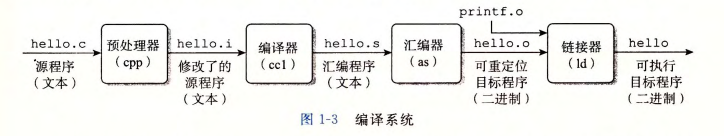
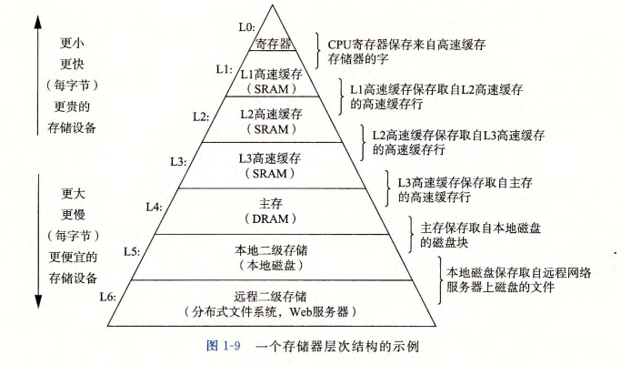

# 第 1 章  计算机系统漫游

信息 == 位 + 上下文

**编译系统组成：** 

- 预处理器
- 编译器
- 汇编器
- 链接器

**从终端输入 `./hello` 到程序执行完成发生了什么？** 

reference：CS：APPv3 P7

1. shell 程序执行它的指令，等待我们输入命令
2. 在键盘输入字符串 ”./hello“，shell 程序将字符串逐一读入寄存器，然后在把它存放到内存中
3. 敲入回车键后，shell 程序知道我们结束了命令的输入
4. shell 程序执行一系列命令从磁盘中加载可执行 `hello` 文件，将 `hello` 目标文件中的代码和数据从磁盘复制到内存
5. 处理器开始执行 `hello` 程序中的 `main` 函数的机器语言指令
6. 这些指令完成的工作是：将 `hello world!` 字符串从内存复制到寄存器；再从寄存器复制到显示设备；最终显示在屏幕上
7. `hello` 程序执行完成，处理器继续执行 shell 程序代码，等待用户输入
8. 待补充：操作系统、进程创建及上下文切换……

**存储层次** 

**计算机系统中抽象的重要性** 

- 指令集架构是对处理器硬件的抽象
- 文件是对 I/O 设备的抽象
- 虚拟内存是对程序存储器（主存和磁盘）的抽象
- 进程是对一个正在运行的程序的抽象
- 虚拟机是对整个计算机的抽象，包括操作系统、处理器和程序

