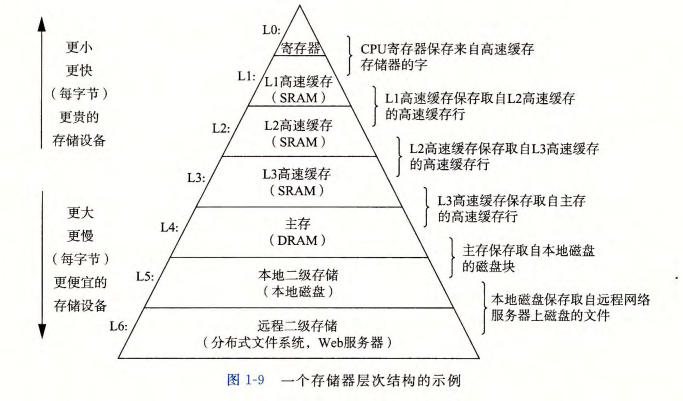

# 第 1 章  计算机系统漫游

信息 == 位 + 上下文

**1、程序编译过程**

  Unix 系统上，编译命令为 `gcc -o hello hello.c` 
	
  编译过程分为预处理、编译、汇编、链接 4 个阶段，如下图：

**编译系统组成：** 

- 预处理器：将程序所包含的系统头文件插入到程序文本中，得到 `.i `文件。
- 编译器：将 `.i` 文件编译称汇编程序，得到 `.s` 文件。
- 汇编器：将 `.s` 文件翻译为机器语言指令，这些指令打包成可重定位目标程序，得到 `.o` 文件。
- 链接器：将程序包含的 `C` 标准库中的函数（预编译的目标文件文件）合并到 `.o` 文件上，得到无后缀可执行文件。

**2、从终端输入 `./hello` 到程序执行完成发生了什么？** 

reference：CS：APPv3 P7

1. shell 程序执行它的指令，等待我们输入命令
2. 在键盘输入字符串 ”./hello“，shell 程序将字符串逐一读入寄存器，然后在把它存放到内存中
3. 敲入回车键后，shell 程序知道我们结束了命令的输入
4. shell 程序执行一系列命令从磁盘中加载可执行 `hello` 文件，将 `hello` 目标文件中的代码和数据从磁盘复制到内存（此处执行的实际上是进程创建工作，更多细节可参考相关资料）
5. 处理器开始执行 `hello` 程序中的 `main` 函数的机器语言指令（此处实际上还存在进程上下文切换问题）
6. 这些指令完成的工作是：将 `hello world!` 字符串从内存复制到寄存器；再从寄存器复制到显示设备；最终显示在屏幕上
7. `hello` 程序执行完成，处理器继续执行 shell 程序代码，等待用户输入

**3、存储层次** 

**4、计算机系统中抽象的重要性** 

- 指令集架构是对处理器硬件的抽象
- 文件是对 I/O 设备的抽象
- 虚拟内存是对程序存储器（主存和磁盘）的抽象
- 进程是对一个正在运行的程序的抽象
- 虚拟机是对整个计算机的抽象，包括操作系统、处理器和程序

**5、操作系统**

	文件是对 I/O 设备的抽象，虚拟内存是对主存和 I/O 设备的抽象，进程是对处理器、主存、I/O 设备的抽象。

- 进程：操作系统提供一种假象，程序看上去独占处理器、主存和 I/O 设备，操作系统保持跟踪进程所需的状态信息（上下文)，并决定切换时机。两个进程的转换由操作系统内核代码管理。
- 虚拟内存：为每个进程提供一种假象，进程看上去独占主存和 I/O 设备。
- 文件：对 I/O 设备的抽象，每个 I/O 设备都可以看成是文件，它向应用程序提供一个统一的视角来看待各种 I/O 设备。
		

**6、并发和并行**

- 线程级并发：采用多核技术，超线程可以将一个物理核虚拟为两个逻辑核，其中 CPU 某些硬件有多个备份（程序计数器、寄存器文件），大大节省线程切换的时间，提高 CPU 的利用率

  			

- 指令集并行：流水线技术
- 单指令、多数据并行：向量机
	

 

