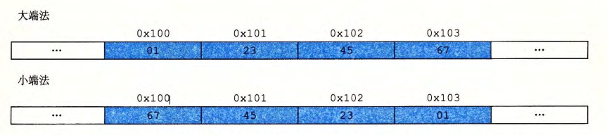

# 第 2 章  信息的表示和处理

## 2.1 信息表示

为了保证程序的可移植性，推荐使用 `int32_t` 、`int64_t`、`uint32_t` 、`uint64_t` 这些指定数据位数的类型，不要使用依赖于编译器、机器字长的数据类型（如 `long` 等）。

**1、指针**

  C编译器把每个指针和类型信息联系起来，根据指针类型，生成不同的机器码访问指针所指位置的值。
  使用一个字节类型的指针`typedef unsigned char *byte_pointer`，能够查看一个变量在内存当中的详细存储内容。
  请参见`字节指针.cpp`
```cpp
#include<stdio.h>
#include<float.h>

typedef unsigned char *byte_pointer; // 字节指针

// 将start所指向的地址空间的，长度为len的内容，以字节形式输出 
void show_bytes(byte_pointer start, size_t len) {
	for(size_t i = 0; i < len; i++)
		printf("%.2x ", start[i]); // .2x 表示整数必须用至少两个数字的十六进制显示 
	printf("\n");
}

int main(){
	
	short m = -1;
	unsigned short n = m; // 整型间的类型转换，不改变原变量的位值 
	show_bytes((byte_pointer) &m, sizeof(short)); 
	show_bytes((byte_pointer) &n, sizeof(unsigned short));
	printf("m = %d, n = %d\n\n", m, n); 
	
	int x = -1;
	float y = float(x); // 整型到浮点型的强制类型转换，会改变原变量的位值 
	show_bytes((byte_pointer) &x, sizeof(int)); 
	show_bytes((byte_pointer) &y, sizeof(float));
	printf("x = %d, y = %f\n\n", x, y);
	
	float a = -1;
	int b = int(a); // 浮点型到整型的强制类型转换，会改变原变量的位值
	show_bytes((byte_pointer) &a, sizeof(int)); 
	show_bytes((byte_pointer) &b, sizeof(float));
	printf("a = %f, b = %d\n\n", a, b);
	
	float max = FLT_MAX, neg1 = -1; // C++ 支持 IEEE754 浮点标准 
	show_bytes((byte_pointer) &max, sizeof(float)); 
	show_bytes((byte_pointer) &neg1, sizeof(float)); 
	printf("max = %f, -1 = %f\n\n", max, neg1);
	
	
	int undefined = (int)1e10; // 产生结果为 INT_MAX 
	show_bytes((byte_pointer) &undefined, sizeof(int)); 
	printf("undefined = %d", undefined); 
	return 0;
}
```


**2、寻址与字节顺序** 

对于跨越多字节的程序对象，有两个关键问题：

1. 对象的地址是什么？

   - 通常，对象地址为所使用的字节中 **最小的地址** 

2. 在内存中如何排列这些字节？

   - 小端存储：最低有效字节在低地址；最高有效字节在高地址

   - 大端存储：与小端存储相反

     > 小端法：最低有效字节在最前面————目前计算机中使用的方法。
     > 大端法：最高有效字节在最前面————符合阅读习惯。
   
   - example：假设变量 x 的类型为 int，位于地址 0X100 处，它的十六进制值为 0X01234567 。 地址范围 0X100~0X103 的字节顺序依赖于机器的类型：
   
     

**3、不用临时变量实现 swap** 

```c
void inplace_swap(int *x, int *y)
{
    if (x == y)
        return;		// 避免 x 与 y 地址相同时，使内存单元变为 0
    *y = *x ^ *y;
    *x = *x ^ *y;
    *y = *x ^ *y;
}
```


## 2.2 整数表示

- 理解有符号数、无符号数、数据类型表示范围、补码、数字位数扩展（零扩展与符号扩展）、数字截断、类型转换时底层位不变特性。

- 补码最高有效位的权重为 -x<sub>w-1</sub> * 2<sup>w-1</sup>，其余位和原码表示的权值相同。

- 几种常见的数值：

  2<sup>w</sup>：取模时用到，保留 w 位有效值

  2<sup>w</sup> - 1：w 位变量能表示的最大值

  2<sup>w-1</sup>：第 w 位的权重

  2<sup>w-1</sup> - 1：w 位有符号数能表示的最大值

- 有符号与无符号整数转换时，保持位值不变。但浮点数和整数转换时，会根据变量的存储规则改变位值。请参见`字节指针.cpp`

- 将 short 转换成 unsigned 时，先进行位扩展，再进行符号转换。unsigned a = short(-1)，得到结果为2<sup>32</sup> - 1。

- C 语法规则对于有符号和无符号变量运算时，默认转换成无符号。有符号到无符号的隐式转换常常导致程序错误。


**注意 C 语言本身的语言特性：**

- 当执行一个运算时，如果一个操作数是有符号的而另一个操作数是无符号的，则 C 语言会 **隐式将有符号数强制类型转换为无符号数** ，并假设这两个数都是非负的，来执行这个运算。 -->  导致对于 `<` 和 `>` 这样的关系型运算符来说，导致非直观的结果。

- 避免踩坑：

  code 1:

  ```c
  /* WARNING: This is buggy code */
  float sum_elements(float a[], unsigned length)
  {
      int i;
      float result = 0;
  
      for (i = 0; i <= length - 1; i++)
          result += a[i];
      return result;
  }
  
  // fix 1
  float sum_elements(float a[], unsigned length)
  {
      int i;
      float result = 0;
  
      for (i = 0; i < length; i++)	// change circle stop condition
          result += a[i];
      return result;
  }
  
  // fix 2
  float sum_elements(float a[], int length)	// change type of paramter length
  {
      int i;
      float result = 0;
  
      for (i = 0; i <= length - 1; i++)
          result += a[i];
      return result;
  }
  ```

  code 2：

  ```c
  /* Determine  whether  strings  is  longer  than  string t  */ 
  /*  WARNING:  This  function  is  buggy  */
  int strlonger(char  *s,  char  *t) 
  { 
  	return  strlen(s)  - strlen(t)  >  0; 
  }
  
  // fix
  int strlonger(char  *s,  char  *t) 
  { 
  	return  strlen(s)  > strlen(t); 	// return type of strlen() is size_t 
      									// (size_t 在头文件 stdio.h 中通过 typedef 定义，为 unsigned int/long)
  }
  ```


## 2.3  整数运算

- 补码加法:


      可以这样理解：对于两个正数 x, y 相加，最高位的权重本应为 2^(w-1)，如果发生溢出，最高位权重变成 -2^(w-1)，故实际结果为 x + y - 2^w，负数同理


- 计算补码的非（可以理解为计算相反数）

      1、补码取反加一。
      2、固定最右侧的1，其左侧所有位取反。
        eg：补码 11001000 -> 源码 00111000

- 对于整数乘法，C语言编译器可以利用移位、加法、减法的组合来消除乘以常数的情况。

- 对于整数除法（除以 2 的幂），直接移位导致向下舍入。可以利用 (x + (1 << k)) >> k 得到向上舍入（对于负数应该向上舍入）。


## 2.3  浮点数表示

- IEEE浮点标准用V = (-1)<sup>s</sup> * M * 2<sup>E</sup>的形式表示一个浮点数

      s为符号位，1为负数，0为正数
      E为阶码，用k位字段exp进行编码
      M为尾数，用n为字段frac编码

  

- 规格化值：

      exp的位既不全 0 也不全 1
      阶码E = exp - Bias （单精度位 255，双精度为 2047）。
      尾数M = 1 + frac

- 非规格化值：提供一种 0 的表示方法，还可以表示一些非常接近 0.0 的数

      exp 全为 0
      阶码E = 1 - Bias （如此定义可实现最小规格化数和最大非规格化数的平滑过渡）
      尾数M = frac

- 特殊值：

      exp全1

- 1 位符号，4 位阶码（Bias = 7），3 位尾数所表示的浮点值如下图：      
  

- 舍入

      向偶数舍入：确定两个可能结果**中间值**的舍入效果，使得最低有效数字是偶数（二进制最低有效位为 0）。避免计算平均值代来的系统误差。
          eg（舍入到 1 / 4）：10.00110 -> 10.01    10.11100 -> 11.00    10.10100 -> 10.10
      向零舍入
      向下舍入
      向上舍入

- 浮点运算的结合性：浮点加法和乘法都不满足结合性

- C 语言中的浮点数：符合 IEEE754 标准，请参见`字节指针.cpp`

      对于 float 值：
      FLOAT_MAX -> 7f 7f ff ff
      -1 -> bf 80 00 00

