# 第 3 章 程序的机器级表示

本章内容基于 x86-64 汇编语言。

主要内容包括：

- C 语言、汇编代码与机器代码之间关系
- 介绍 x86-64 细节，包括数据的表示和处理以及控制的实现
- 介绍如何实现 C 语言的控制结构
- 介绍过程的实现，包括程序如何维护运行栈以支持过程间数据和控制的传递、局部变量的存储等
- 介绍如何在机器级实现数组、结构、联合这样的数据结构
- 讨论内存访问越界问题、缓冲区溢出攻击问题
- GDB 调试技巧

## 3.1  历史观点

Intel 处理器系列俗称 x86 。


## 3.2 程序编码

1. 机器级代码包括的处理器状态：

   - 程序计数器（PC）：在 x86-64 中用 `%rip` 表示
   - 整数寄存器文件：16 个 64 位寄存器
   - 条件码寄存器：保存最近执行的算术或逻辑运算的状态信息
   - 一组向量寄存器：可存放一个或多个整数或浮点值

2. 代码示例：

   `010-mstore.c 源文件` 

   ```c
   /* $begin 010-mstore-c */
   long mult2(long, long);
   
   void multstore(long x, long y, long *dest) {
       long t = mult2(x, y);
       *dest = t;
   }
   /* $end 010-mstore-c */
   ```

   使用 ` gcc .\010-mstore.c -Og -S` 命令编译，得到如下汇编代码：

   ```assembly
   	.file	"010-mstore.c"
   	.text
   	.globl	multstore
   	.type	multstore, @function
   multstore:
   .LFB0:
   	.cfi_startproc
   	pushq	%rbx		# 表示将寄存器 %rbx 的内容压入程序栈中
   	.cfi_def_cfa_offset 16
   	.cfi_offset 3, -16
   	movq	%rdx, %rbx
   	call	mult2
   	movq	%rax, (%rbx)
   	popq	%rbx
   	.cfi_def_cfa_offset 8
   	ret
   	.cfi_endproc
   .LFE0:
   	.size	multstore, .-multstore
   	.ident	"GCC: (GNU) 4.8.5 20150623 (Red Hat 4.8.5-44)"
   	.section	.note.GNU-stack,"",@progbits
   
   ```

   使用 `gcc -Og -c 010-mstore.c` 命令得到目标代码文件 `010-mstore.o` ，为二进制文件。

   使用反汇编器查看机器语言对应汇编代码，命令：`objdump -d 010-mstore.o` ，输出如下：

   ```assembly
   
   010-mstore.o：     文件格式 elf64-x86-64
   
   
   Disassembly of section .text:
   
   0000000000000000 <multstore>:
      0:   53                      push   %rbx
      1:   48 89 d3                mov    %rdx,%rbx
      4:   e8 00 00 00 00          callq  9 <multstore+0x9>
      9:   48 89 03                mov    %rax,(%rbx)
      c:   5b                      pop    %rbx
      d:   c3                      retq
   ```

   其中，左边为机器代码，右边为对应的汇编指令。其中，x 在 `%rdi` 寄存器；y 在 `%rsi` 寄存器；dest 在 `%rdx` 寄存器。


## 3.3 数据格式

Intel 中术语 ”字（word）” 表示 16 位；32 位称为 “双字（double words）” ；64 位称为 “四字（quad word）”。

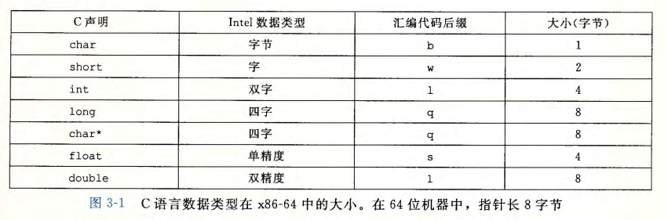

后缀 `l` 表示双字，因为 32 数被看作 “长字（long word）”。`l` 也表示双精度浮点数。


## 3.4 访问信息

x86-64 处理器有 16 个 64 位通用目的寄存器。

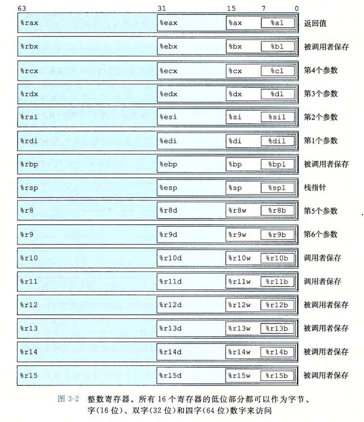

### 3.4.1 操作数指示符

操作数有三种类型：

1. 立即数：在 ATT 格式汇编中，书写格式为 \$ 后面跟着一个用标准 C 语言表示法的常数，如 `$-577` 或 `$0x1F` 。
2. 寄存器：表示某个寄存器的内容。
3. 内存引用：根据计算出来的地址（通常称为有效地址）访问某个内存位置。

寻址模式：

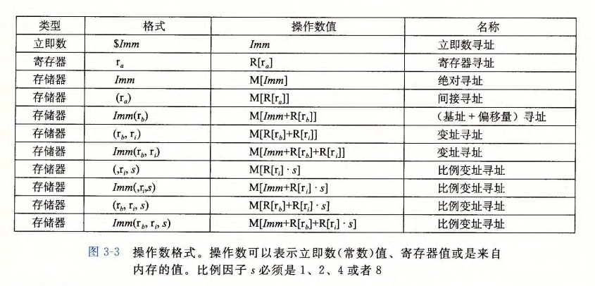

### 3.4.2 数据传送指令

1. MOV 类指令：将 source（S）值写入 destination（D）

   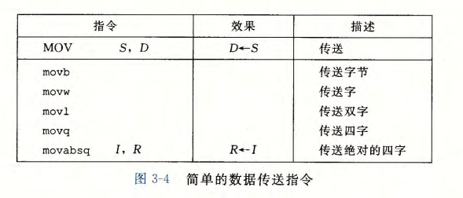

   注意：将一个值从一个内存位置复制到另一个内存位置，需要两条指令：先将源操作数加载到寄存器；再将寄存器值写入目的地址。

   其中，`movabsq` 指令用途是将 64 位立即数传送到寄存器中。常规的 `movq` 指令只能将 32 位补码数字作为立即数，然后将其符号扩展得到 64 位值，放到目的位置。

2. MOVZ 类指令与 MOVS 类指令：分别将目的地址中剩余字节填 0 和进行符号扩展来填充

   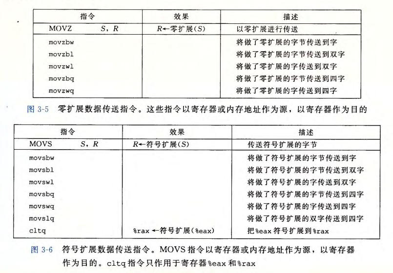

   

### 3.4.3 数据传送示例

C 代码：

```c
/* $begin 050-exchange-c */
long exchange(long *xp, long y)
{
    long x = *xp;
    *xp = y;
    return x;
}
/* $end 050-exchange-c */
```

汇编代码：

```assembly
	.file	"050-exchange.c"
	.text
	.globl	exchange
	.type	exchange, @function
exchange:
	movq	(%rdi), %rax
	movq	%rsi, (%rdi)
	ret
	.size	exchange, .-exchange
	.ident	"GCC: (Ubuntu 4.8.1-2ubuntu1~12.04) 4.8.1"
	.section	.note.GNU-stack,"",@progbits

```

其中，xp 存储在 `$rdi` ；y 存储在 `$rsi` 。


### 3.4.4 压入和弹出数据

栈指针 `$rsp` 保存着栈顶元素的地址。x86-64 中，栈向低地址增长。

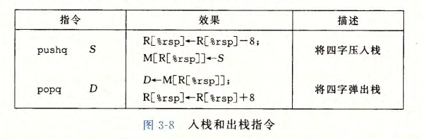


## 3.5 算术和逻辑操作

常用指令见下图。其中，除了 `leaq` 指令外，其它指令都有不同位宽的变种。

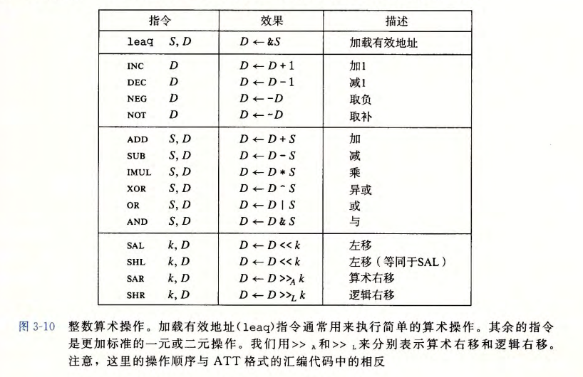

### 3.5.1 加载有效地址

leaq 指令。常用来执行简单的算术运算。

C 代码：

```c
long scale(long x, long y, long z) {
    long t = x + 4 * y + 12 * z;
    return t;
}
```

对应汇编代码：（x in `$rdi`  ; y in `%rsi` ; z in `%rdx` ）

```assembly
scale:
	leaq	(%rdi,%rsi,4), %rax		# x + 4*y
	leaq	(%rdx,%rdx,2), %rdx		# y + 2*z
	leaq	(%rax,%rdx,4), %rax		# x + 4*y + 4*(z + 2*z) = x + 4*y + 12*z
	ret
```


### 3.5.2 一元和二元操作

- 一元操作：只有一个操作数，既是源操作数又是目的操作数
- 二元操作：第二个操作数既是源操作数又是目的操作数。第一个操作数可以是立即数、寄存器或者内存位置；第二个操作数可以是寄存器或内存地址。当第二个操作数为内存地址时，处理器必须先从内存读出值，执行操作，然后再把结果写回内存。


### 3.5.3 移位操作

先给出移位量；再给出要移位的数。

- 移位量：要么为立即数；要么必须放在 `%cl` 寄存器中。对于 w 位长的数据而言，真正的移位量由 `%cl` 寄存器的低 m 位决定，其中 2^m^ = w ，高位会被忽略
- 右移分为算术右移 `SAR` 和逻辑右移 `SHR` 
- 目的操作数可以位寄存器或者内存位置


### 3.5.4 特殊的算术操作

16 个字节的数称为八字（oct word）。相关乘除运算指令如下：

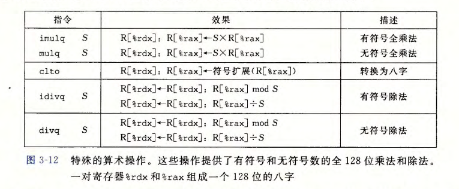

1. 乘法指令
   - imulq 指令：”双操作数“ 乘法指令
   - ”单操作数“ 乘法指令：要求一个参数必须在寄存器 `%rax` 中；另一个源操作数指令给出。乘积高 64 位存放在 `%rdx` 寄存器中；低 64 位存放在 `%rax` 寄存器中
     1. 无符号乘法指令 `mulq` 
     2. 补码乘法指令 `imulq` 
2. 除法指令
   - 有符号除法指令 `idivl` ：将寄存器 `%rdx` （高 64 位）和寄存器 `%rax` （低 64 位）中的 128 位数作为被除数；除数作为指令的操作数给出。指令将商存储在寄存器 `%rax` 中；余数存储在寄存器 `%rdx` 中
   - 对于 64 位除法来说，被除数也是 64 位的值。则应该将这个值存放在 `%rax` 中，`%rdx` 寄存器将根据为有符号运算或者无符号运算设置为符号位或者全 0。对于有符号运算，这个操作可以由指令 `cqto` 完成。`cqto` 指令不需要任何操作数，它隐含读出 `%rax` 寄存器的符号位并将它复制到 `%rdx` 的所有位


## 3.6 控制

### 3.6.1 条件码

CPU 中还有一组单个位的条件码寄存器，用于描述最近的算术或逻辑操作的属性。可以检测这些寄存器来执行条件分支。常用条件码有：

- CF :  进位标志。最近的操作使最高位产生了进位。可用来检查无符号操作的溢出
- ZF :  零标志。最近的操作得出的结果为 0
- SF :  符号标志。最近的操作得到的结果为负数
- OF :  溢出标志。最近的操作导致一个补码溢出——正溢出或负溢出

`leaq` 指令不改变任何条件码。

除了图 3-10 中指令外，还有两类指令会设置条件码而不改变任何其他寄存器：

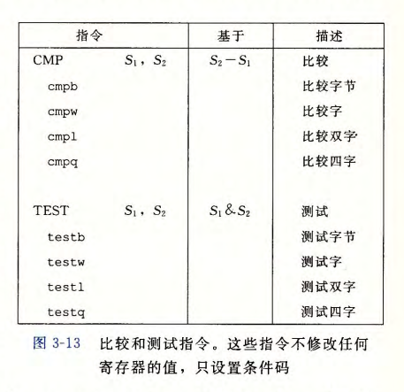

其中，CMP 指令除了只设置条件码不改变目的寄存器之外，与 SUB 命令的行为一致。TEST 指令行为与 AND 指令一样，除了其设置条件码而不改变目的寄存器值。


### 3.6.2 访问条件码

通常不会直接读取条件码，常用的使用方式有以下三种：

1. 根据条件码某种组合，将某个字节设置为 0 或 1：SET 指令，具体见下图：

   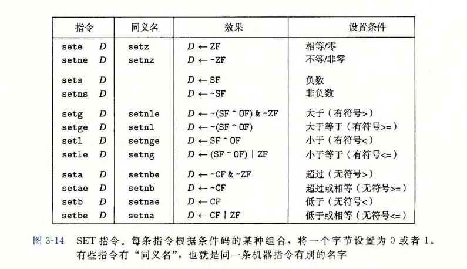

   其中，这些指令的后缀代表不同的条件，如：setl 表示 set less；setb 表示 set below。

   其目的操作数是低位单字节寄存器元素之一或者一个字节的内存地址。为了得到 32 或 64 位的结果，必须要对高位清零。

2. 条件跳转到程序某个其他部分

3. 有条件地传送数据


### 3.6.3 跳转指令

`jmp` 指令，通常后面为 label 。它可以是直接跳转（label 指出），即跳转目标作为指令的一部分编码；也可以是间接跳转（‘*’ 后面跟一个操作数指示符，如：`jmp *%rax` 与 `jmp *(%rax)` 分别以寄存器值和内存值作为跳转目标），即跳转目标是从寄存器或内存地址读出的。

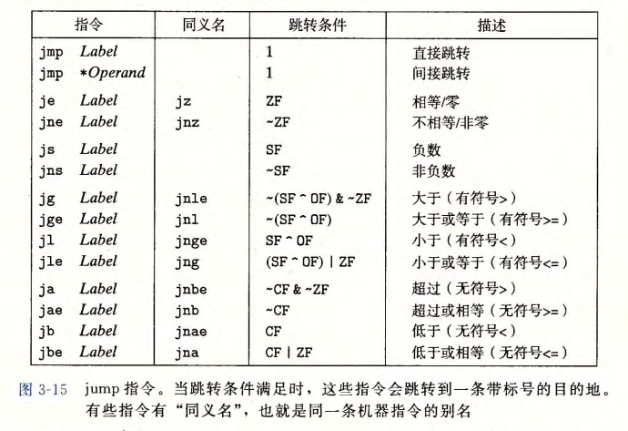

上图中除了 `jmp` 指令都是有条件的，条件跳转只能是直接跳转。


### 3.6.4 跳转指令的编码

当执行 PC 相对寻址时，程序计数器的值是跳转指令后面的那条指令的地址，而不是跳转指令本身的地址。因为 CPU 将更新程序计数器作为执行一条指令的第一步。


### 3.6.5 用条件控制来实现条件分支

C 语言中的 *if-else* 语句通用形式模板：

```c
if (test-expr)
    then-statement
else
    else-statement
```

对于上述形式，汇编语言通常使用如下形式：

```assembly
    t = test-expr
    if (!t)
        goto false;		# 条件分支
	then-statement
	goto done;			# 无条件分支
false:
	else-statement
done:
```


### 3.6.6 使用条件传送来实现条件分支

Example：

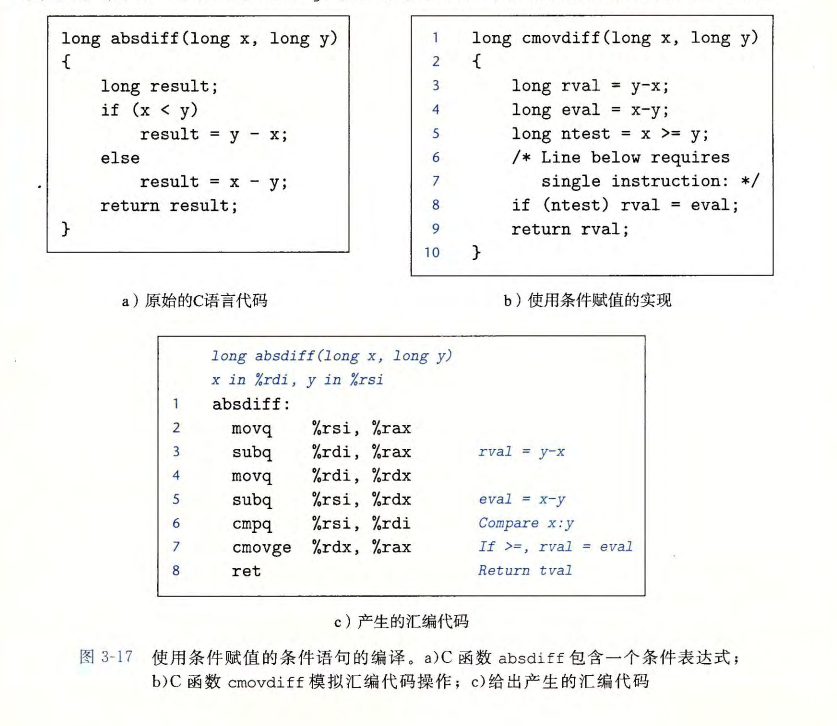

**为什么基于条件数据传送的代码比基于条件控制转移的代码性能好？**

流水线与分支预测机制。


一些条件传送指令如下：

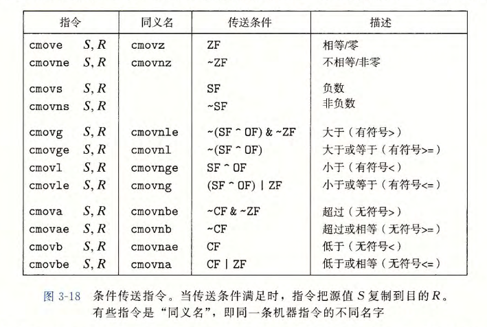

与条件跳转不同，处理器无需预测测试的结果就可以执行条件传送。不过，条件传送会对 *then-statement* 和 *else-statement* 都求值。一旦两个表达式中任意一个可能产生错误条件或者副作用，就会导致非法行为。例如下面的代码不能使用条件传送，必须使用条件转移：

```c
long cread(long *xp)
{
    return xp ? *xp : 0;
}
```

另外，使用条件传送并不总是能提高代码效率，例如 *else-statement* 或 *if-statement* 需要大量计算，那么当对应的条件不满足时，这些计算就浪费了。


### 3.6.7 循环

1. **do-while 循环** 

   *do-while* 语句通用形式如下：

   ```c
   do
       body-statement
       while (test-expr);
   ```

   汇编形式：

   ```assembly
   loop:
   	body-statement
   	t = test-expr;
   	if (t)
   		goto loop;
   ```

2. **while 循环** 

   *while* 语句形式：

   ```c
   while (test-expr)
       body-statement
   ```

   汇编形式 1：跳转到中间

   ```assembly
   	goto test;
   loop:
   	body-statement
   test:
   	t = test-expr;
   	if (t)
   		goto loop;
   ```

   汇编形式 2：guarded-do

   ```assembly
   t = test-expr;
   if (!t)
   	goto done;
   do
   	body-statement
   	while (test-expr);
   done:
   ```

3. **for 循环** 

   *for* 循环通用形式：

   ```c
   for (init-expr; test-expr; update-expr)
       body-statement;
   ```

   汇编形式 1：跳转到中间

   ```assembly
   	init-expr;
   	goto test;
   loop:
   	body-statement;
   	update-expr;
   test:
   	t = test-expr;
   	if (t)
   		goto loop;
   ```

   汇编形式 2：guarded-do

   ```assembly
   	init-expr;
   	t = test-expr;
   	if (!t)
   		goto done;
   loop:
   	body-statement;
   	update-expr;
   	t = test-expr;
   	if (t)
   		goto loop;
   done:
   ```


### 3.6.8 switch 语句

Example：

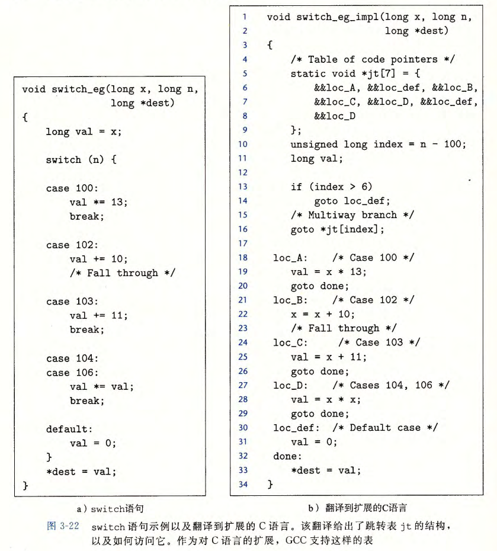


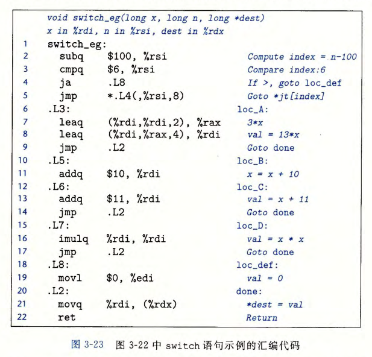

跳转表对重复情况的处理就是简单地对表项 4 和 6 使用同样的代码标号（loc_D）；对缺失情况的处理就是使用默认情况标号（loc_def）。

在汇编代码中，跳转表声明在叫做 “.rodata" （只读数据，Read-Only-Data）的目标代码文件的段中：

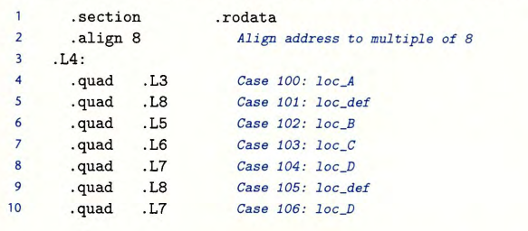


## 3.7 过程

假设过程 P 执行过程 Q，Q 执行完成后返回到 P。这些动作包含下面一个或多个机制：

- 传递控制：进入过程 Q 时，PC 要被设置为 Q 代码起始地址；返回时，要把 PC 设置为 P 中调用 Q 的后面那条指令的地址
- 传递数据：P 必须能够向 Q 提供一个或多个参数；Q 必须能够向 P 返回一个值
- 分配和释放内存：开始时，Q 可能要为局部变量分配空间；返回前，要释放这些存储空间

### 3.7.1 运行时栈

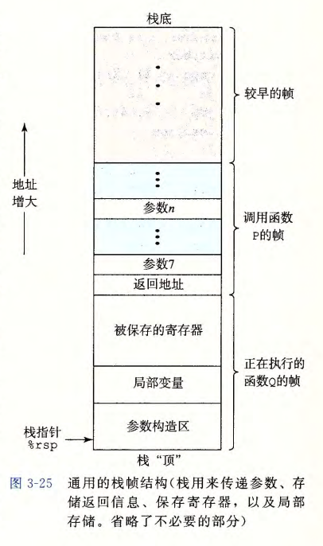

### 3.7.2  转移控制

在 x86-64 机器中，指令 `call Q` 把地址 A 压入栈中，并将 PC 设置为 Q 的起始地址。压入的地址 A 被称为返回地址，时紧跟在 call 指令后面的那条指令的地址。对应的指令 `ret` 会从栈中弹出地址 A，并把 PC 设置为 A 。


### 3.7.3 数据传送

x86-64 中，寄存器最多可以传递 6 个整型（即整数和指针）参数。超过的部分要通过栈来传递。


### 3.7.4 栈上的局部存储

部分情况，局部数据必须放在内存中：

- 寄存器不足够存放所有的本地数据
- 对一个局部变量使用地址运算符＇＆＇，因此必须能够为它产生一个地址
- 某些局部变量是数组或结构，因此必须能够通过数组或结构引用被访问到

一般而言，过程通过减小栈指针在栈上分配空间。


### 3.7.5 寄存器中的局部存储空间

寄存器组是唯一被所有过程共享的资源。

在 x86-64 中，寄存器使用惯例如下：

- **被调用者保存寄存器**：寄存器 %rbx 、 %rbp 和 %r12~%r15 ，即过程 P 调用过程 Q 时， Q 必须保存这些寄存器的值，保证它们的值在 Q 返回到 p 时与 Q 被调用时是一样的。
- **调用者保存寄存器**：所有其他的寄存器，处理栈指针 %sp ，这意味着任何过程都能够修改它们。


### 3.7.6 递归过程

上述寄存器和栈惯例使得 x86-64 过程能够递归地调用它们自身。


## 3.8 数组分配和访问

连续分配若干个字节。

多维数组按 ”行优先“ 顺序排列。

编译器会对数组访问进行很多优化，能够显著提高程序性能。


## 3.9 异质的数据结构

### 3.9.1 结构 struct

C 语言的 struct 声明创建 一个数据类型，将可能不同类型的对象聚合到一个对象中。用名字来引用结构的各个组成部分。类似千数组的实现，结构的所有组成部分都存放在内存中一段连续的区域内，而指向结构的指针就是结构第一个字节的地址。**编译器维护关于每个结构类型的信息，指示每个字段（如Id) 的字节偏移。它以这些偏移作为内存引用指令中的位移，从而产生对结构元素的引用**。


###  3.9.2 联合 union

联合提供了一种方式，能够规避 C 语言的类型系统，允许以多种类型来引用一个对象。联合声明的语法与结构的语法一样，只不过语义相差比较大。它们是用不同的字段来引用相同的内存块 。

一个联合的总的大小等于其最大字段的大小。联合可以用来访问不同数据类型的位模式。


### 3.9.3 数据对齐

对齐原则：任何 K 字节的基本对象的地址必须是 K 的倍数。


## 3.10 在机器级程序中将控制与数据结合起来

### 3.10.1 理解指针

略


### 3.10.2 应用：使用 GDB 调试器

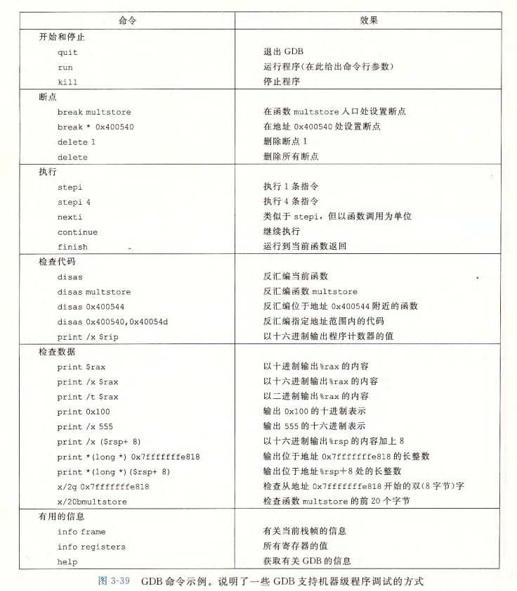

### 3.10.3 内存越界引用与缓冲区溢出

C 语言库函数 `gets` 可能导致缓冲区溢出。

```c
/* $begin bufdemo-c */
/* Implementation of library function gets() */
char *gets(char *s)
{
    int c;
    char *dest = s;
    while ((c = getchar()) != '\n' && c != EOF) 
        *dest++ = c;
    *dest++ = '\0'; /* Terminate String */
    if (c == EOF)
        return NULL;
    return s;  
}

/* Read input line and write it back */
void echo()
{
    char buf[4];  /* Way too small! */
    gets(buf);
    puts(buf);
}
/* $end bufdemo-c */
```

很多库函数，如 `strcpy` 、`strcat` 、`sprintf` 都可能导致缓冲区溢出漏洞。

几种缓冲区溢出攻击形式：

- 输入程序一个字符串，这个字符串含有一些可执行代码的字节编码，称为攻击代码
- 用一个指向攻击代码的指针覆盖返回地址


### 3.10.4 对抗缓冲区溢出攻击

1. **栈随机化** 

   为了在系统中插入攻击代码，攻击者既要插入代码，也要插入指向这段代码的指针，这个指针也是攻击字符串的 一 部分。产生这个指针需要知道这个字符串放置的栈地址 。 在过去，程序的栈地址非常容易预测 。 对于所有运行同样程序和操作系统版本的系统来说，在不同的机器之间，栈的位置是相当固定的 。 因此，如果攻击者可以确定一个常见的 Web 服务器所使用的栈空间，就可以设计一个 在许多机器上都能实施的攻击。

   栈随机化思想是：让栈的位置在程序每次运行时都有变化。

   实现方式：

   > 程序开始时，在栈上分配一段 0 ~ n 字节之间的随机大小的空间，例如，使用分配函数 alloca 在栈上分配指定字节数量的空间 。 程序不使用这段空间，但是它会导致程序每次执行时后续的栈位置发生了变化 。分配的范围 n 必须足够大，才能获得足够多的栈地址变化，但是又要足够小，不至于浪费程序太多的空间。

   栈随机化大大降低了病毒或蠕虫传播速度，但是，栈随机化不能提供完全的安全保障。

2. **栈破坏检测** 

   最近的 GCC 增加了 *栈保护者 (stack protector) 机制* ，其思想是：在栈帧中任何局部缓冲区与栈状态之间存储一个特殊的金丝雀 (canary) 值, 如图 3-42 所示 。这个金丝雀值，也称为哨兵值 (guard  value),  是在程序每次运行时随机产生的，因此，攻击者没有简单的办法能够知道它是什么。在恢复寄存器状态和从函数返回之前，程序检查这个金丝雀值是否被该函数的某个操作或者该函数调用的某个函数的某个操作改变了。如果是的，那么程序异常中止。

   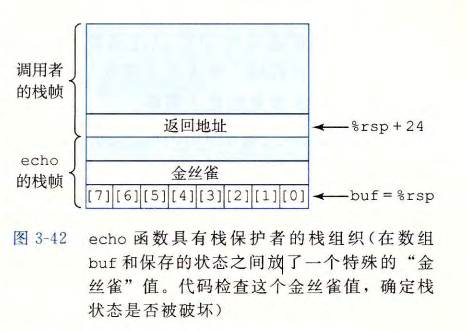

3. **限制可执行代码区域** 

   消除攻击者向系统中插入可执行代码的能力。虚存，分页，标记页的权限从而限制栈上字节序列不可执行。


### 3.10.5 支持变长栈帧

为了管理变长栈帧， x86-64 代码使用寄存器 %rbp 作为 *帧指针 (frame pointer)* (有时称为基指针 (base pointer) ,  这也是 %rbp 中 bp 两个字母的由来）

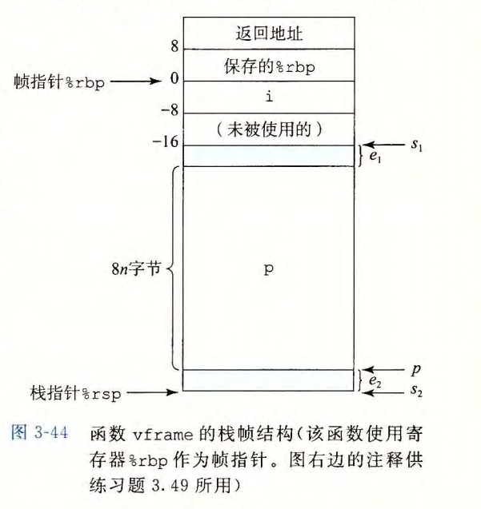


## 3.11 浮点代码


