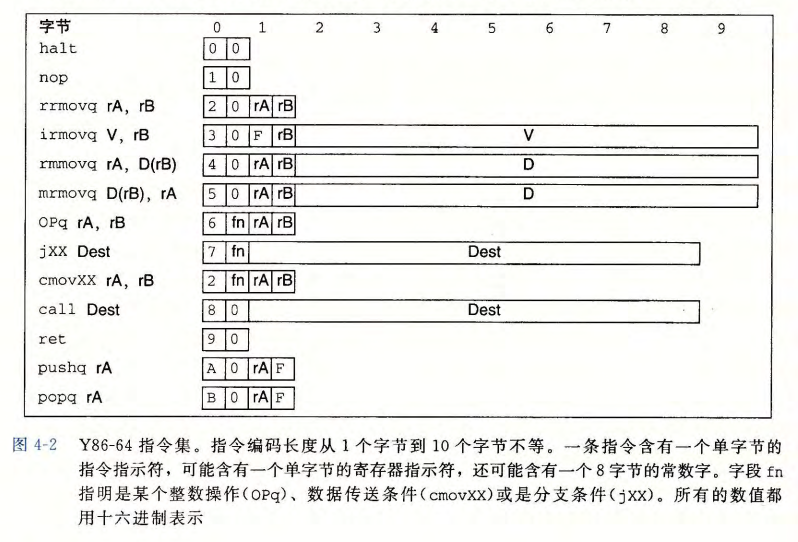
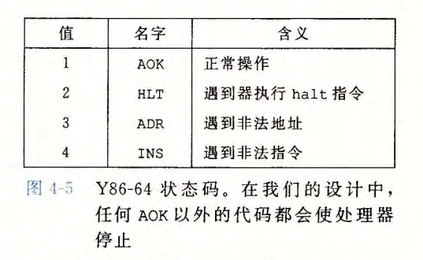
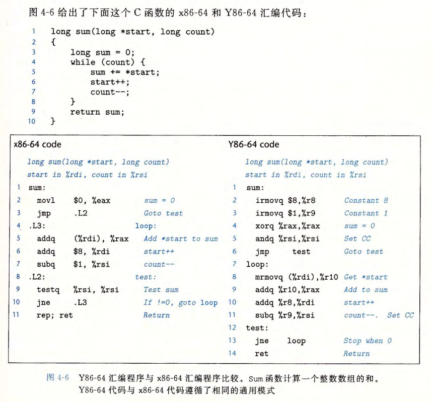
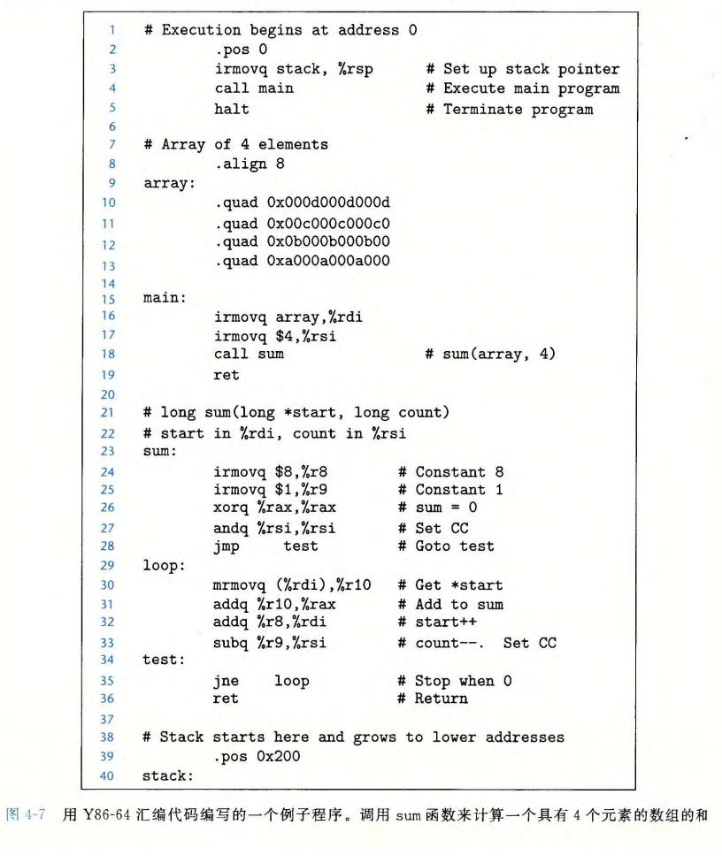

# 第 4 章  处理器体系结构

指令集体系结构（Instruction-Set Architecture，ISA）：一个处理器支持的指令和指令的字节级编码。ISA 在编译器编写者和处理器设计人员之间提供了一个概念抽象层：

- 编译器编写者只需要知道允许哪些指令以及它们是如何编码的
- 处理器设计者必须构造出执行这些指令的处理器

本章将简要介绍处理器硬件设计。主要内容如下：

- 先定义一个简单的指令集，称为 `Y86-64 指令集` 
- 介绍数字硬件设计背景
- 设计一个单周期处理器
- 设计流水线处理器

## 4.1 Y86-64 指令集体系结构

### 4.1.1 程序员可见的状态

Y86-64 的状态类似 x86-64 。具体如下：

- 有 15 个程序寄存器：%rax 、 %rcx 、%rdx 、 %rbx 、% rsp 、% rbp 、% rsi 、% rdi 和 %r8 到 %r14，每个寄存器为 64 位
- 寄存器 %rsp 被入栈、出栈、调用和返回指令作为栈指针
- 3 个一位的条件码 ：ZF 、 SF 和 OF, 它们保存若最近的算术或逻辑指令所造成影响的有关信息
- 程序计数器 (PC) 存放当前正在执行指令的地址
- 内存：用虚拟地址来引用内存地址
- 状态码 Stat：表明程序执行的总体状态

### 4.1.2 Y86-64 指令

Y86-64 ISA 中各个指令简单描述如下（左边为指令汇编代码表示；右边为字节编码）：

### 4.1.3 指令编码

如上图所示，每个指令需 1~10 个字节不等。

- 每个指令第一个字节表明指令类型
- 寄存器按 %rax 、 %rcx 、%rdx 、 %rbx 、% rsp 、% rbp 、% rsi 、% rdi 和 %r8 到 %r14 顺序编号为 0~15 
- 整数采用小端编码

### 4.1.4 Y86-64 异常

状态码 Stat 描述程序执行的总体状态，其可能值如下：

遇到异常时，处理器停止执行。实际的处理器中，通常会调用异常处理程序处理遇到的异常。

### 4.1.5 Y86-64 程序

Example：

一个完整的 Y86-64 汇编程序：

### 4.1.6 一些 Y86-64 指令的详情

`pushq` 指令会把栈指针减去 8 ，并且将一个寄存器值写入内存中。因此，当执行 `pushq %rsp` 指令时，处理器行为是不确定的，因为要入栈的寄存器会被同一条指令修改。通常有两种不同的约定：

1. 压入 %rsp 的原始值
2. 压入减去 8 的 %rsp 值

对于 Y86-64 处理器来说，采用和 x86-64 相同的做法，即上述方案 1 。

## 4.2 逻辑设计和硬件控制语言 HCL

