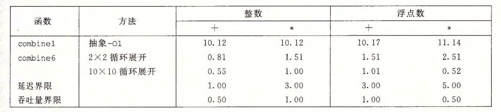

# 第 5 章  优化程序性能

本章通过一个例子：一个数组所有元素之和/积的算法，讨论了程序性能优化的常用手段。


## 5.1 优化编译器的能力和局限性

GCC 优化选项：

- \-Og：基本优化
- \-O1 或 更高（\-O2 或 \-O3）：更多的优化

编译器优化代码时首先保证正确性，不能与原始代码执行逻辑有差异。


## 5.2 表示程序性能

CPE：Cycles Per Element，每元素的周期数，用于表示程序性能。

设有一个规模为 n 的问题，用 y 表示程序执行周期数，若 y 与 n 存在线性关系：y = a*n + b，则系数 a 被称为 CPE 的有效值。（越小则算法效率越高）


## 5.3 程序示例

略


## 5.4 消除循环的低效率

常用手段：

- 代码移动：识别要多次执行（如循环中）但是计算结果不会改变的计算，将计算移动到前面不会被多次求值的部分。


## 5.5 减少过程调用

将通过调用函数访问向量元素改为通过下标直接访问，从而减少过程调用。


## 5.6 消除不必要的内存引用

循环中通过指针的内存引用，可以通过引入临时变量消除。


## 5.7 理解现代处理器

现代处理器特点：指令级并行

两个界限：

- 延迟界限：任何必须按照严格顺序完成合并运算的函数所需要的最小 CPE 值
- 吞吐量界限：给出了 CPE 的最小界限

### 5.7.1 整体操作

现代处理器特性：

- 超标量：在每个时钟周期执行多个操作
- 乱序：指令执行顺序不一定与机器级程序中指令顺序一致
- 分支预测

实现这些特性的硬件结构包括：

- 指令控制单元（ICU）：负责从内存（指令 cache）中取出指令，并产生一系列基本操作（微操作）
- 执行单元（EU）：完成这些操作，并指出分支预测是否正确

### 5.7.2 功能单元的性能

- 延迟：表示完成运算所需的总时间
- 发射时间：表示两个连续的同类型运算直接需要的最小时钟周期数（通过流水线实现）
- 容量：表示执行该运算的功能单元数量
- 最大吞吐量：发射时间的倒数

### 5.7.3 处理器操作的抽象模型

程序的数据流图：描述程序数据相关的一种方法。核心是寻找图的关键路径。


## 5.8 循环展开

循环展开：通过增加每次迭代运算的元素的数量，减少循环的迭代次数。

循环展开从两方面改进程序性能：

- 减少了不直接有助于程序结果的操作的数量，如循环索引计算和条件分支
- 提供了一些方法，可以进一步变换代码，减少整个计算中关键路径上的操作数量


## 5.9 提高并行性

核心：减少数据相关，充分利用运算的流水线性能。

### 5.9.1 多个累积变量

通过引入多个临时变量，记录和或积，从而减少数据相关。


### 5.9.2 重新结合变换

通过括号结合，改变运算顺序，减少数据相关影响。


## 5.10 优化合成代码的结果小结




## 5.11 一些限制因素

### 5.11.1 寄存器溢出

多个累积变量取值不应该太大，否则会导致寄存器移除，反而导致性能下降。


### 5.11.2 分支预测和预测错误处罚

- 不要过分关心可预测的分支
- 书写适合用条件传送实现的代码


## 5.12 理解内存性能

1. 加载的性能：从存储器中**读**数的延迟
2. 存储的性能：**写**内存的延迟，写 / 读相关会导致延迟增加


## 5.13 应用：性能提高技术

优化程序性能的基本策略：

1. 高级设计：适当的算法数据结构
2. 基本编码原则：避免限制优化的因素，以利用编译器优化性能
   - 消除连续的函数调用
   - 消除不必要的内存引用
3. 低级优化：结构化代码以利用硬件功能
   - 循环展开，降低开销，并且使得进一步优化成为可能
   - 使用多个累积变量和重新结合等技术，找到提高指令级并行的方法
   - 用功能性的分割重写条件操作，使得编译采用条件数据传送（减少分支预测失败开销）

**注意**：正确性比性能更重要，优化程序性能时要警惕引入错误。


## 5.14 确认和消除性能瓶颈

本小节介绍如何优化大型程序。

### 5.14.1 程序剖析

使用 GPROF 程序剖析程序，步骤如下：

1. 程序必须为剖析而编译和链接

   ```shell
   $ gcc -Og -pg prog.c -o prog
   ```

2. 正常运行程序

   ```shell
   $ ./prog file.txt    # file.txt 为运行 prog 所需的命令行参数
   ```

   与往常不同的是，运行程序后产生一个文件 `gmon.out` 。

3. 调用 GPROF 程序分析 `gmon.out` 中的数据

   ```shell
   $ gprof prog
   ```

   输出剖析报告。

### 5.14.2 使用剖析程序来指导优化

根据剖析报告，可以找出程序性能瓶颈，进而优化程序。


**参考阅读**

本章以数组累加 / 乘作为例子讲解了程序性能优化的常用手段。[Matrix Multiplication](https://ocw.mit.edu/courses/electrical-engineering-and-computer-science/6-172-performance-engineering-of-software-systems-fall-2018/lecture-slides/MIT6_172F18_lec1.pdf) 以矩阵乘法为例，讨论了程序性能优化的手段，可作为本章参考阅读材料。

