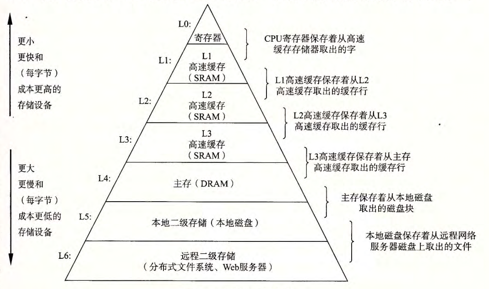

# 第 6 章  存储器层次结构

关键概念：

- 不同存储器访问速度和容量
- 程序局部性原理

## 6.1 存储技术

随机访问存储器（RAM）：

- SRAM：常用作 Cache
- DRAM：常用作主存，需要定时刷新

磁盘：

- 磁盘访问时间约为毫秒级

固态硬盘：

- 比磁盘访问时间快， 但是寿命（写次数）有限

## 6.2 局部性

局部性原理：

- 时间局部性
- 空间局部性

## 6.3 存储器层次结构

## 6.4 高速缓存存储器

现代 CPU 一般有三级缓存（L1，L2，L3）

Cache 映射方式：

- 直接映射
- 组相联映射
- 全相联映射

## 6.5 编写 Cache 友好的代码

基本方法：

- 让最常见的情况运行得快
- 尽量减少每个循环内部的缓存不命中数量（注意多维数组访问顺序）

## 6.6 综合：Cache 对程序性能的影响

略

