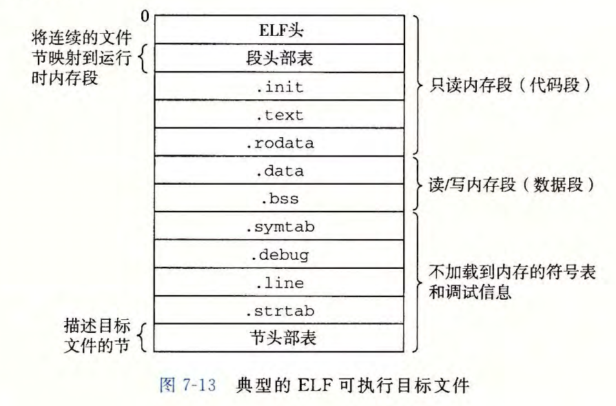

# 第 7 章  链接

链接：将各种代码和数据片段收集并组合成一个单一文件的过程，这个文件可以被加载（复制）到内存并执行。

链接可能的执行阶段：

- 编译时
- 加载时
- 运行时


## 7.1 编译器驱动程序

有两个源文件：

`main.c`

```c
/* main.c */
/* $begin main */
int sum(int *a, int n);

int array[2] = {1, 2};

int main()
{
    int val = sum(array, 2);
    return val;
}
/* $end main */
```

`sum.c`

```c
/* sum.c */
/* $begin sum */
int sum(int *a, int n)
{
    int i, s = 0;

    for (i = 0; i < n; i++) {
        s += a[i];
    }
    return s;
}
/* $end sum */
```

使用下面命令编译：

```shell
$ gcc -Og -o prog main.c sum.c
```


> **补充**
>
> Linux 终端如何查看程序运行结束的返回值？
>
> ```shell
> $ ./prog
> $ echo $?
> ```
>
> 一次执行上述两条命令，即可查看 `prog` 程序返回值。


编译过程如下图所示（图中括号表示完成该功能的程序）：


## 7.2 静态链接

`ld` 程序称为静态连接器，以一组可重定位目标文件和命令行参数作为输入，输出一个完全链接的、可以加载和运行的可执行目标文件。

为了构造可执行文件，链接器必须完成两个主要任务：

- 符号解析：将每个符号引用恰好与一个符号定义关联起来
- 重定位：链接器使用汇编器产生的重定位条目 (relocation entry) 的详细指令，执行重定位 


## 7.3 目标文件

目标文件三种形式：

- 可重定位目标文件：包含二进制代码和数据，其形式可以在编译时与其他可重定位目标文件合并起来，创建一个可执行目标文件 。
- 可执行目标文件：包含二进制代码和数据，其形式可以被直接复制到内存并执行 。
- 共享目标文件：一种特殊类型的可重定位目标文件，可以在加载或者运行时被动态地加载进内存并链接。

ELF 是目标文件的一种格式，全称是：可执行可链接格式（Executable and Linkable Format，ELF）。


## 7.4 可重定位目标文件

典型的 ELF 可重定位目标文件格式如下：


各节含义如下：

- .text: 已编译程序的机器代码。
- .rodata:  只读数据，比如 printf 语句中的格式串和开关语句的跳转表。
- .data:  已初始化的全局和静态 C 变量。局部 C 变量在运行时被保存在栈中，既不出现在 .data 节中，也不出现在 .bss 节中。
- . bss:  未初始化的全局和静态 C 变量，以及所有被初始化为 0 的全局或静态变量。在目标文件中这个节不占据实际的空间，它仅仅是 一 个占位符。目标文件格式区分已初始化和未初始化变量是为了空间效率：在目标文件中，未初始化变量不需要占据任何实际的磁盘空间。运行时，在内存中分配这些变量，初始值为 0 。
- .symtab:  一个符号表，它存放在程序中定义和引用的函数和全局变量的信息。一些程序员错误地认为必须通过 -g 选项来编译一个程序，才能得到符号表信息。实际上，每个可重定位目标文件在 .symtab 中都有一张符号表（除非程序员特意用 STRIP 命令去掉
  它）。然而，和编译器中的符号表不同，. symtab 符号表不包含局部变量的条目。
- .rel.text:  一个 .text 节中位置的列表，当链接器把这个目标文件和其他文件组合时，需要修改这些位置。一般而言，任何调用外部函数或者引用全局变量的指令都需要修改。另一方面，调用本地函数的指令则不需要修改。注意，可执行目标文件中并不需要重定位信息，因此通常省略，除非用户显式地指示链接器包含这些信息。
- . rel. data: 被模块引用或定义的所有全局变最的重定位信息。一般而言，任何已初始化的全局变最，如果它的初始值是一个全局变量地址或者外部定义函数的地址，都需要被修改。
- .debug:  一个调试符号表，其条目是程序中定义的局部变量和类型定义，程序中定义和引用的全局变量，以及原始的 C 源文件。只有以 -g 选项调用编译器驱动程序时，才会得到这张表。

- .line: 原始 C 源程序中的行号和 .text 节中机器指令之间的映射。只有以 -g 选项调用编译器驱动程序时，才会得到这张表。
- . strtab: 一个字符串表，其内容包括 .symtab 和 .debug 节中的符号表，以及节头部中的节名字。字符串表就是以 null 结尾的字符串的序列。


## 7.5 符号和符号表

链接器上下文中三种不同的符号：

- 由模块 m 定义且能够被其他模块引用的全局符号，对应于非静态的 C 函数和全局变量
- 由其他模块定义且被模块 m 引用的全局符号。这些符号称为外部符号，对应于在其他模块中定义的非静态的 C 函数和全局变量
- 只被模块 m 定义和引用的局部符号，对应于带 static 属性的 C 函数和全局变量。这些符号在模块 m 中任何位置都可见，但是不能被其他模块引用


## 7.6 符号解析

全局符号的分类：

- 强符号：函数和已经初始化的全局变量
- 弱符号：未初始化的全局变量


链接器如何解析多重定义的全局符号？

- 规则 1：不允许有多个同名的强类型符号
- 规则 2：如果有一个强符号和多个弱符号同名，那么选择强符号
- 规则 3：如果有多个弱符号同名，那么从这些弱符号中任意选择一个


静态库：C 语言提供的标准 C 函数都放在一个静态可重定位目标模块中。


## 7.7 重定位

重定位由两步组成：

- 重定位节和符号含义：合并相同类型的节，并赋予新的运行时内存地址
- 重定位节中的符号引用：链接器修改代码节和数据节中对每个符号的引用，使得它们指向正确的运行时地址


## 7.8 可执行目标文件

典型的 ELF 文件格式：




## 7.9 加载可执行目标文件

加载：将程序复制到内存并执行的过程。

shell 终端调用 execve 函数来调用加载器，从而执行目标文件。

Linux 程序运行时内存映像：


## 7.10 动态链接共享库

共享库也称共享目标，在 Linux 系统中用 `.so` 后缀来表示；Windows 中用 `.dll` 后缀表示。

动态链接示意图如下：


## 7.11 从应用程序中加载和链接共享库

Linux 中使用 `dlopen` 等函数加载和链接共享库。

```c
#include <dlfcn.h>

void *dlopen(const char *filename, int flag);	// 成功返回指向句柄的指针，出错返回 NULL

void *dlsym(void *handle, char *symbol);		// 成功返回指向符号的指针；出错返回 NULL

int dlclose(void *handle);						// 成功返回 0，出错返回 -1
```


示例代码如下：

```c
/* $begin dll */
#include <stdio.h>
#include <stdlib.h>
#include <dlfcn.h>

int x[2] = {1, 2};
int y[2] = {3, 4};
int z[2];

int main()
{
    void *handle;
    void (*addvec)(int *, int *, int *, int);
    char *error;

    /* Dynamically load the shared library that contains addvec() */
    handle = dlopen("./libvector.so", RTLD_LAZY);
    if (!handle) {
        fprintf(stderr, "%s\n", dlerror());
        exit(1);
    }

    /* Get a pointer to the addvec() function we just loaded */
    addvec = dlsym(handle, "addvec");
    if ((error = dlerror()) != NULL) {
        fprintf(stderr, "%s\n", error);
        exit(1);
    }

    /* Now we can call addvec() just like any other function */
    addvec(x, y, z, 2);
    printf("z = [%d %d]\n", z[0], z[1]);

    /* Unload the shared library */
    if (dlclose(handle) < 0) {
        fprintf(stderr, "%s\n", dlerror());
        exit(1);
    }
    return 0;
}
/* $end dll */
```


## 7.12 位置无关代码

位置无关代码（Position-Independent Code，PIC）：可以加载而无需重定位的代码。用户对 GCC 使用 -fpic 选项指示 GNU 编译系统生成 PIC 代码。 共享库的编译必须使用该选项 。


## 7.13 库打桩机制

库打桩：允许用户截获对共享库函数的调用，取而代之指向自己的代码。

基本思想：给定一 个需要打桩的目标函数，创建一个包装函数，它的原型与目标函数完全一样。使用某种特殊的打桩机制，你就可以欺骗系统调用包装函数而不是目标函数了。包装函数通常会执行它自己的逻辑，然后调用目标函数，再将目标函数的返回值传递给调用者。

打桩可以发生在编译时、链接时或当程序被加载和执行的运行时。

- 编译时打桩

  gcc 命令：

  ```shell
  $ gcc -DCOMPILETIME -c mymalloc.c
  $ gcc -I. -o intc int.c mymalloc.o
  $ ./intc
  malloc(32)=0x21b1010
  free(0x21b1010)
  ```

  源代码：

  `mymalloc.c`

  ```c
  /* $begin interposer */
  #ifdef RUNTIME
  #define _GNU_SOURCE
  #include <stdio.h>
  #include <stdlib.h>
  #include <dlfcn.h>
  
  /* malloc wrapper function */
  void *malloc(size_t size)
  {
      void *(*mallocp)(size_t size);
      char *error;
  
      mallocp = dlsym(RTLD_NEXT, "malloc"); /* Get address of libc malloc */
      if ((error = dlerror()) != NULL) {
          fputs(error, stderr);
          exit(1);
      }
      char *ptr = mallocp(size); /* Call libc malloc */
      printf("malloc(%d) = %p\n", (int)size, ptr);
      return ptr;
  }
  
  /* free wrapper function */
  void free(void *ptr)
  {
      void (*freep)(void *) = NULL;
      char *error;
  
      if (!ptr)
          return;
  
      freep = dlsym(RTLD_NEXT, "free"); /* Get address of libc free */
      if ((error = dlerror()) != NULL) {
          fputs(error, stderr);
          exit(1);
      }
      freep(ptr); /* Call libc free */
      printf("free(%p)\n", ptr);
  }
  #endif
  /* $end interposer */
  
  /*
   * Link-time interposition of malloc and free using the static
   * linker's (ld) "--wrap symbol" flag.
   *
   * Compile the executable using "-Wl,--wrap,malloc -Wl,--wrap,free".
   * This tells the linker to resolve references to malloc as
   * __wrap_malloc, free as __wrap_free, __real_malloc as malloc, and
   * __real_free as free.
   */
  /* $begin interposel */
  #ifdef LINKTIME
  #include <stdio.h>
  
  void *__real_malloc(size_t size);
  void __real_free(void *ptr);
  
  /* malloc wrapper function */
  void *__wrap_malloc(size_t size)
  {
      void *ptr = __real_malloc(size); /* Call libc malloc */
      printf("malloc(%d) = %p\n", (int)size, ptr);
      return ptr;
  }
  
  /* free wrapper function */
  void __wrap_free(void *ptr)
  {
      __real_free(ptr); /* Call libc free */
      printf("free(%p)\n", ptr);
  }
  #endif
  /* $end interposel */
  
  /*
   * Compile-time interpositioning of malloc and free using the C
   * preprocessor. A local malloc.h file defines malloc and free as
   * wrappers mymalloc and myfree respectively.
   */
  /* $begin interposec */
  #ifdef COMPILETIME
  #include <stdio.h>
  #include <malloc.h>
  
  /* malloc wrapper function */
  void *mymalloc(size_t size)
  {
      void *ptr = malloc(size);
      printf("malloc(%d)=%p\n",
             (int)size, ptr);
      return ptr;
  }
  
  /* free wrapper function */
  void myfree(void *ptr)
  {
      free(ptr);
      printf("free(%p)\n", ptr);
  }
  #endif
  /* $end interposec */
  ```

  

- 链接时打桩

  gcc 命令：

  ```shell
  $ gcc -DLINKTIME -c mymalloc.c
  $ gcc -c int.c
  $ gcc -Wl,--wrap,malloc -Wl,--wrap,free -o intl int.o mymalloc.o
  $ ./intl
  malloc(32) = 0x18a3010
  free(0x18a3010)
  ```

  

- 运行时打桩

  ```shell
  $ gcc -DRUNTIME -shared -fpic -o mymalloc.so mymalloc.c -ldl
  $ gcc -o intr int.c
  $ LD_PRELOAD="./mymalloc.so" ./intr
  malloc(32) = 0x1bf8010
  free(0x1bf8010)
  ```

  现在，可以用 LD_PRELOAD 对任何可执行程序的库函数调用打桩：

  ```shell
  $ LD_PRELOAD="./mymalloc.so" /usr/bin/uptime
  ```


## 7.14 处理目标文件的工具


