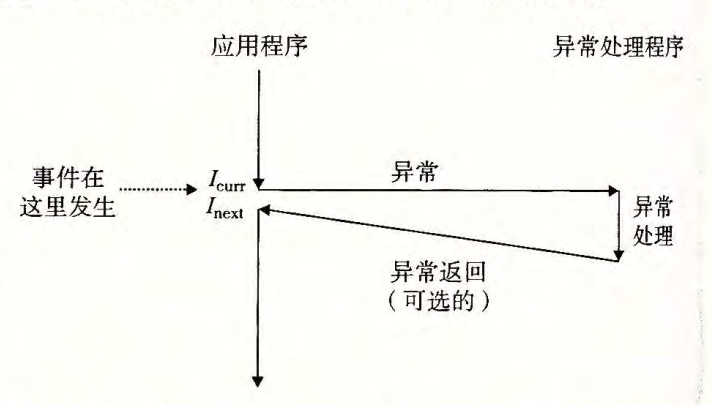
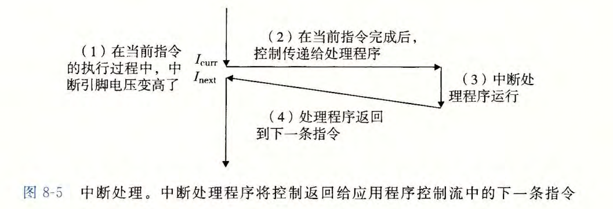
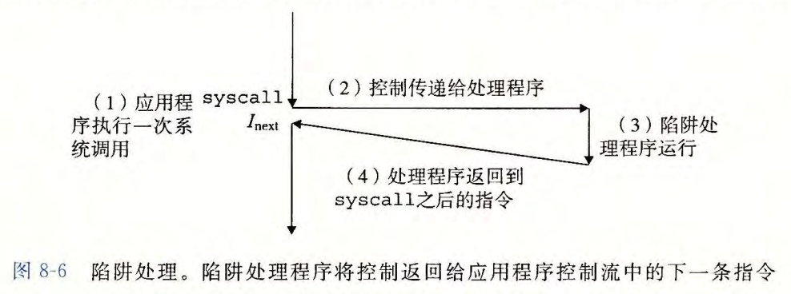
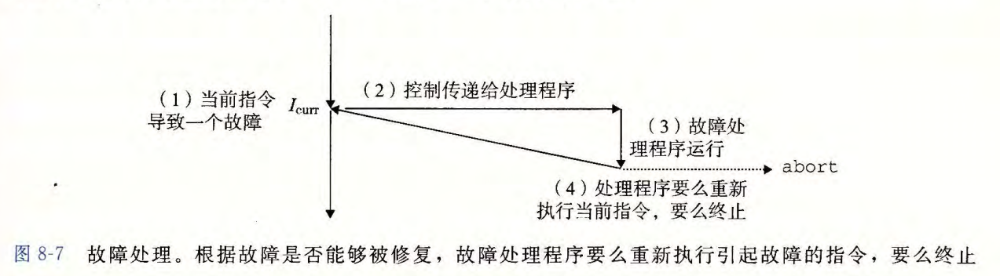
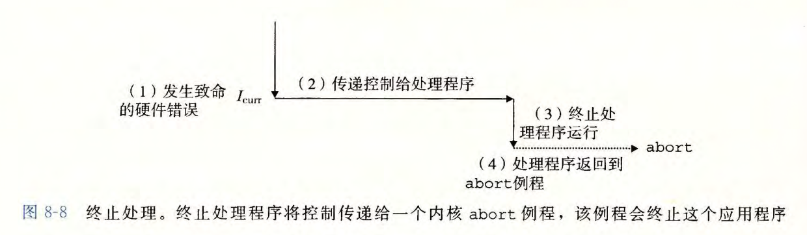
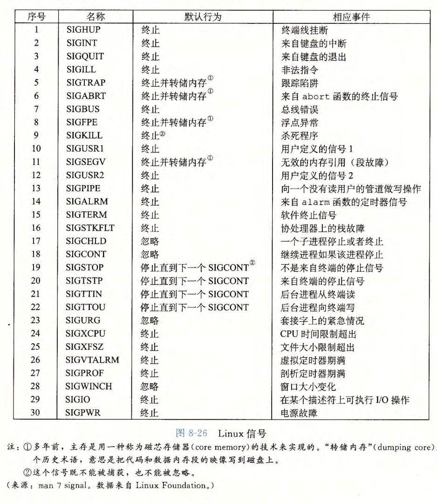
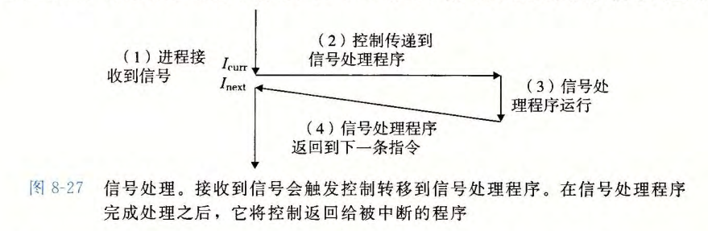

# 第 8 章  异常控制流

异常控制流（Exception Control Flow，ECF）：控制流的突变（即 PC 地址不是连续增长，而是有突变），是系统对系统状态变化（如定时器信号、数据包到达网卡等）做出反应的机制。


## 8.1 异常

异常（exception）就是控制流中的突变，用来响应处理器状态中的某些变化。异常处理基本思想如下：



异常的分类：

- 中断：来自 I/O 设备的信号；异步；总是返回下一条指令

  中断处理流程：

  

- 陷阱和系统调用：有意的异常；同步；总是返回下一条指令

  陷阱最重要用途就是在用户程序和内核之间提供一个像过程一样的接口，叫做*系统调用*。系统调用运行在内核模式中。

  系统调用流程如下：

  

- 故障：潜在可恢复的错误；同步；可能返回当前指令

  故障处理流程如下：

  

- 终止：不可恢复的错误；同步；不会返回

  终止处理流程如下：

  


## 8.2 进程

略（操作系统课程中更详细）


## 8.3 系统调用错误处理

当 Unix 系统级函数遇到错误时，它们通常会返回 -1, 并设詈全局整数 变 量 errno 来表示什么出错了。

Example：

```c
if (pid = fork() < 0) {
    fprintf(stderr,  "fork  error:  %s\n",  strerror(errno)); 
    exit(0);
}
```


其中，strerror 函数返回一个文本串，描述了和某个 errno 值相关联的错误 。 


## 8.4 进程控制

本小节介绍 Unix 系统中进程相关的系统 API。

1. 获取进程 ID

   ```c
   #include <systypes.h>
   #include <unistd.h>
   
   pid_t getpid(void);		// 返回调用进程 ID
   pid_t getppid(coid);	// 返回调用进程的父进程 ID
   ```

   

2. 创建和终止进程

   ```c
   #include <stdlib.h>
   
   void exit(int status);	// 终止进程
   ```

   ```c
   #include <systypes.h>
   #include <unistd.h>
   
   pid_t fork(void);		// 创建子进程  
   ```

   `fork` 函数被调用一次却会返回两次：一次是在调用进程（父进程）中，一次是在新创建的子进程中。在父进程中， fork 返回子进程
   的 pid。在子进程中， fork 返回 0 。因为子进程的 pid 总是为非零，返回值就提供一个明确的方法来分辨程序是在父进程还是在子进程中执行。

   Example：

   ```c
   #include "csapp.h"
   
   /* $begin fork */
   /* $begin wasidefork */
   int main()
   {
       pid_t pid;
       int x = 1;
   
       pid = Fork(); //line:ecf:forkreturn
       if (pid == 0) {  /* Child */
           printf("child : x=%d\n", ++x); //line:ecf:childprint
           exit(0);
       }
   
       /* Parent */
       printf("parent: x=%d\n", --x); //line:ecf:parentprint
       exit(0);
   }
   /* $end fork */
   /* $end wasidefork */
   ```

   

3. 回收子进程

   一个进程通过调用 waitpid 函数来等待它的子进程终止或停止：

   ```c
   #include <sys/types.h>
   #include <sys/wait.h>
   
   pid_t waitpid(pid_t pid, int *statusp, int options);
   // 返回：若成功，返回子进程 PID；若 WNOHANG ，返回 0；若有其他错误，返回 -1
   ```

   也可以使用简化版本的 wait 函数：

   ```c
   #include <sys/types.h>
   #include <sys/wait.h>
   
   pid_t wait(int *statusp);	// 调用 wait(&status) 等价于调用 waitpid(-1, &status, 0)。其中 -1 表示等待所有子进程  
   ```

   Example：

   ```c
   /* $begin waitpid1 */
   #include "csapp.h"
   #define N 2
   
   int main()
   {
       int status, i;
       pid_t pid;
   
       /* Parent creates N children */
       for (i = 0; i < N; i++)                       //line:ecf:waitpid1:for
           if ((pid = Fork()) == 0)  /* Child */     //line:ecf:waitpid1:fork
               exit(100+i);                          //line:ecf:waitpid1:exit
   
       /* Parent reaps N children in no particular order */
       while ((pid = waitpid(-1, &status, 0)) > 0) { //line:ecf:waitpid1:waitpid
           if (WIFEXITED(status))                    //line:ecf:waitpid1:wifexited
               printf("child %d terminated normally with exit status=%d\n",
                      pid, WEXITSTATUS(status));     //line:ecf:waitpid1:wexitstatus
           else
               printf("child %d terminated abnormally\n", pid);
       }
   
       /* The only normal termination is if there are no more children */
       if (errno != ECHILD)                          //line:ecf:waitpid1:errno
           unix_error("waitpid error");
   
       exit(0);
   }
   /* $end waitpid1 */
   ```

   运行结果如下：

   ```shel
   $ ./waitpid1
   child 6915 terminated normally with exit status=100
   child 6916 terminated normally with exit status=101
   ```

   说明：每次运行输出的 PID 和 两个子进程运行顺序不一定。

4. 让进程休眠

   sleep 函数将一个进程挂起一段时间：

   ```c
   #include <unistd.h>
   
   unsigned int sleep(unsigned int);	// 如果请求的时间量已经到了， sleep 返回 o, 否则返回还剩下的要休眠的秒数   
   ```

   

5. 加载并运行程序

   execve 函数在当前进程的上下文中加载并运行一个新程序：

   ```c
   #include <unistd.h>
   
   int execve(const char *filename, const char *argv[], const char *envp[]);
   ```

   execve 函数加载并运行可执行目标文件 filename, 且带参数列表 argv 和环境变量列表 envp 。只有当出现错误时，例如找不到 filename, execve 才会返回到调用程序。所以，与 fork 一次调用返回两次不同， execve 调用一次并从不返回。

   Linux 提供了几个函数来操作环境数组：

   ```c
   #include <stdlib.h>
   
   char *getenv(const char *name);	// 若存在则返回指向 value 的指针；若无匹配的返回 NULL  
   
   
   int setenv(const char *name, const char *newvalue, int overwrite); 	// 成功返回 0；否则返回 -1
   
   
   void unsetenv(const char *name); 
   ```

   

6. 利用 fork 和 execve 运行程序

   shell 和 Web 服务器大量使用了 fork 和 execve 函数。


## 8.5 信号

Linux 信号：一种更高层的软件形式异常，允许进程和内核中断其他进程。

Linux 支持的信号如下：



信号处理程序捕获信号的基本思想：




信号相关的 Linux 系统 API 略，可参考相关资料。


## 8.6 非本地跳转

C 语言提供了一种用户级异常控制流形式，称为非本地跳转 (nonlocal jump),  它将控制直接从一个函数转移到另一个当前正在执行的函数，而不需要经过正常的调用-返回序列。非本地跳转是通过 setjmp 和 longjmp 函数来提供的 。

```c
#include <setjmp.h>

int setjmp(jmp_buf env);
int sigsetjmp(sigjmp_buf env, int savesigs);
```


setjmp 函数在 env 缓冲区中保存当前调用环境，以供后面的 longjmp 使用，并返回 0 。调用环境包括程序计数器、栈指针和通用目的寄存器。setjmp 返回值不能被赋值给变量。

longjmp 函数从 env 缓冲区中恢复调用环境，然后触发 一 个从最近一次初始化 env 的 setjmp 调用的返回。然后 setjmp 返回，并带有非零的返回值 retval 。

非本地跳转的一个重要应用就是允许从一个深层嵌套的函数调用中立即返回，通常是由检测到某个错误情况引起的。如果在一个深层嵌套的函数调用中发现了一个错误情况，我们可以使用非本地跳转直接返回到一个普通的本地化的错误处理程序，而不是费力地解开调用栈。

Example：

```c
/* $begin setjmp */
#include "csapp.h"

jmp_buf buf;

int error1 = 0;
int error2 = 1;

void foo(void), bar(void);

int main()
{
    switch(setjmp(buf)) {
    case 0:
        foo();
        break;
    case 1:
        printf("Detected an error1 condition in foo\n");
        break;
    case 2:
        printf("Detected an error2 condition in foo\n");
        break;
    default:
        printf("Unknown error condition in foo\n");
    }
    exit(0);
}

/* Deeply nested function foo */
void foo(void)
{
    if (error1)
        longjmp(buf, 1);
    bar();
}

void bar(void)
{
    if (error2)
        longjmp(buf, 2);
}
/* $end setjmp */
```


## 8.7 操作进程的工具

- STRACE：打印一个正在运行的程序和它的子进程调用的每个系统调用的轨迹。用 `-static` 编译程序，能得到一个更干净的、不带有大量与共享库相关的输出的轨迹
- PS：列出当前系统中的进程（包括僵死进程）
- TOP：打印出关千当前进程资源使用的信息
- PMAP：显示进程的内存映射
- /proc：一个虚拟文件系统，以 ASCII 文本格式输出大量内核数据结构的内容，用户程序可以读取这些内容。比如，输入 "cat  /proc/loadavg", 可以看到 Linux 系统上当前的平均负载


