# 第 9 章  虚拟内存

## 9.1 物理和虚拟寻址

- **物理寻址**：早期 CPU 采用的访问内存方式，CPU 执行指令计算出物理地址，然后直接访问内存。工作图示如下：

  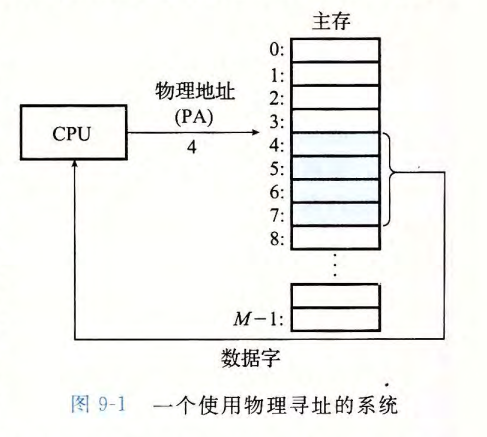

- **虚拟寻址**：现代 CPU 采用的寻址方式，CPU 执行指令计算出虚拟地址，经过内存管理单元（MMU）的翻译之后，得到物理地址，然后再访问内存。图示如下：

  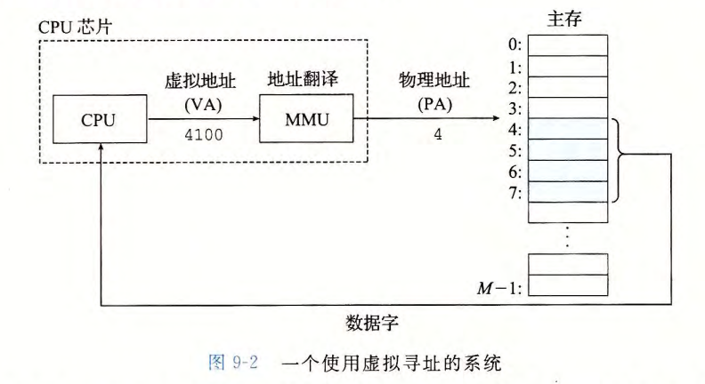


## 9.2 地址空间

地址空间：一个非负整数地址的有序集合。可进一步分为：

- 物理地址空间
- 虚拟地址空间

主存的每个字节都有一个选自虚拟地址空间的虚拟地址和选自物理地址空间的物理地址。


## 9.3 虚拟内存作为缓存的工具

虚拟内存（VM）系统涉及两大存储器件：**主存**（全部） 和 **硬盘**（部分，即 Linux 中的 `swap` 分区），它们都被划分为固定大小的连续单元。其中硬盘上的称为**虚拟页**；主存上的称为 **物理页** 或 **页帧** 。 


虚拟页面分为下面三个不相交的子集：

- **未分配的**：VM 系统还未分配（或者创建）的页 。 未分配的块没有任何数据和它们相关联，因此也就不占用任何磁盘空间。
- **缓存的**：当前已缓存在物理内存中的已分配页 。
- **未缓存的**：未缓存在物理内存中的已分配页 。

一个示意图如下：

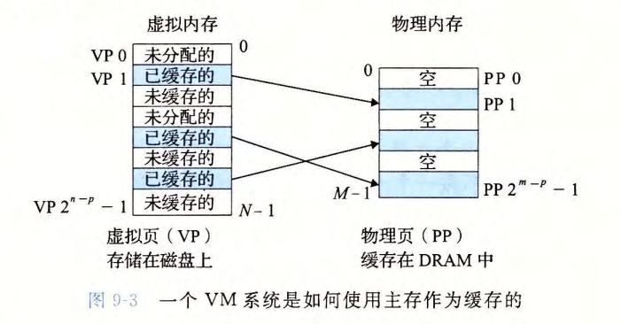


## 9.4 虚拟内存作为内存管理的工具

操作系统为每个进程提供了一个独立的页表，因而也就是一个独立的虚拟地址空间。如下图所示：

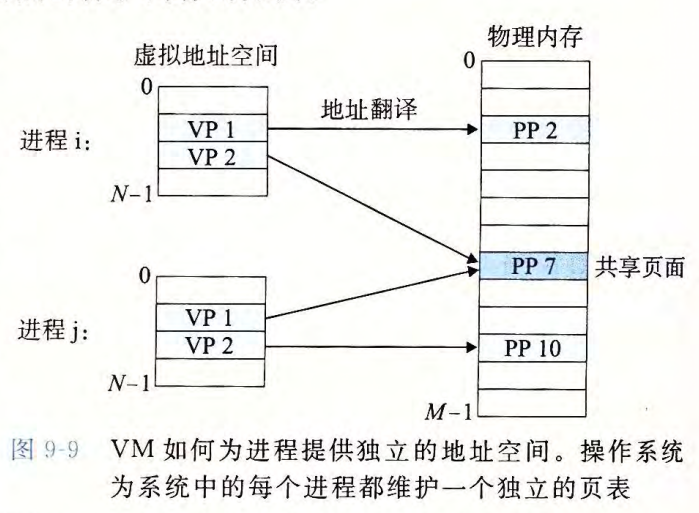

VM 简化了链接和加载、代码和数据共享，以及应用程序的内存分配。

将一组连续的虚拟页映射到任意一个文件中的任意位置的表示法称作 **内存映射** (mem­ory mapping) 。 Linux 提供一个称为 mmap 的系统调用，允许应用程序自己做内存映射。


## 9.5 虚拟内存作为内存保护的工具

提供独立的地址空间使得区分不同进程的私有内存变得容易。利用虚拟内存提供内存保护示意图如下：

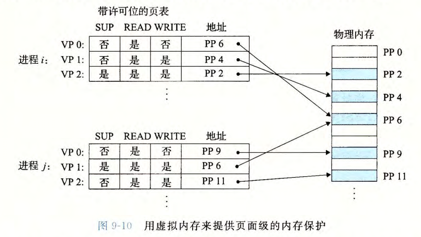

在上图中，每个 PTE（Page Table Entry，页表条目） 增加了 3 个许可位：

- SUP：表示进程是否必须运行在内核（超级用户）模式下才能访问该页。运行在内核模式下的进程可以访问任何页面；运行在用户模式下的进程只允许访问 SUP 为为 0 的页面。
- READ 和 WRITE：控制对页面的读写

如果一条指令违反了这些许可条件，那么 CPU 就触发一个一般保护故障，将控制传递给一个内核中的异常处理程序。 Linux shell 一般将这种异常报告为段错误 (segmenta­tion  fault)" 。


## 9.6 地址翻译

CPU 中有一个控制寄存器：**页表基址寄存器**（Page Table Base Register，PTBR）指向当前页表。

n 位 **虚拟地址** 包括两部分：

- 一个 p 位的 **虚拟页面偏移**（Virtual Page Offset，VPO）
- 一个 n - p 位的 **虚拟页号**（Virtual Page Number，VPN）

示意图如下：

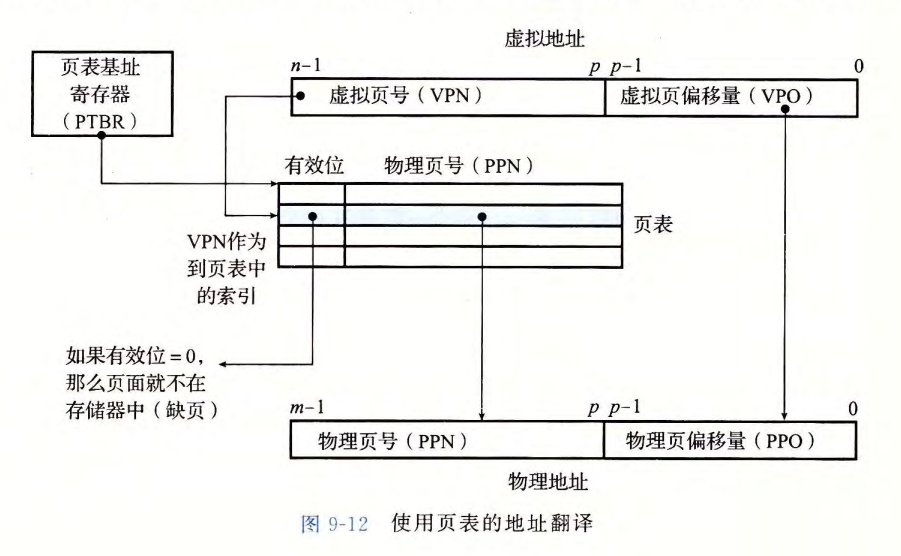

当页面命中时，地址翻译过程如下（完全由硬件处理）：

1. 处理器生成一个虚拟地址，并将其传送给 MMU
2. MMU 根据上图 9-12 所示规则解析出 VPN，结合页表基址寄存器生成 PTE 地址，并从高速缓存/主存中得到它
3.  高速缓存/主存向 MMU 返回 PTE
4. MMU 构造物理地址，并把它传送给高速缓存/主存
5. 高速缓存/主存返回所请求的数据字给处理器

当缺页时，处理过程如下（硬件和操作系统内核协同完成）：

1. 1-3 步和页面命中情况相同

4. PTE 中有效位是 0，触发异常，传递 CPU 中的控制到操作系统内核中的缺页异常处理程序
5. 缺页处理程序确定出物理内存中的牺牲页，如果这个页面已经被修改了，则把它换出到磁盘
6. 缺页处理程序页面调入新的页面，并更新内存中的 PTE 
7. 缺页处理程序返回到原来的进程，再次执行导致缺页的指令。 CPU 将引起缺页的虚拟地址重新发送给 MMU 。因为虚拟页面现在缓存在物理内存中，所以就会命中，在 MMU 执行了图 9-13b 中的步骤之后，主存就会将所请求字返回给处理器。

上述两个地址翻译过程如下图所示：

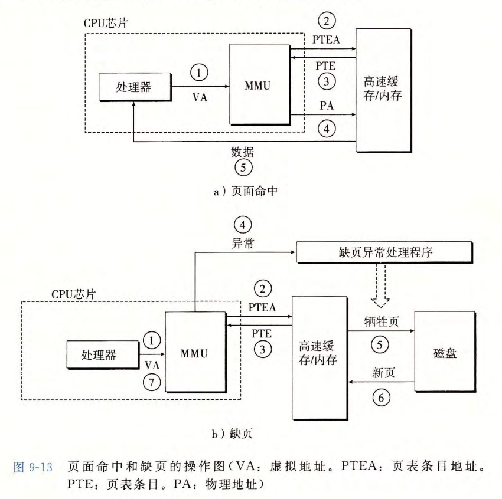


## 9.7 案例研究：Intel Core i7/Linux 内存系统

Intel Core i7 地址翻译示意图：

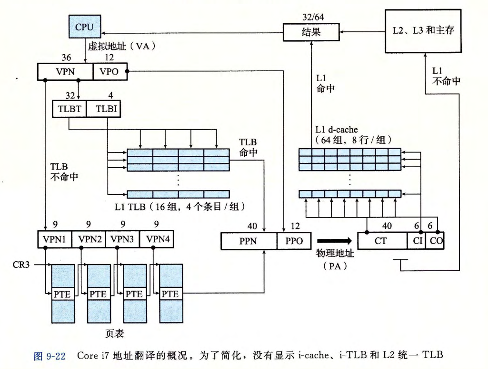

Linux 为每个进程维护了一个单独的虚拟地址空间：

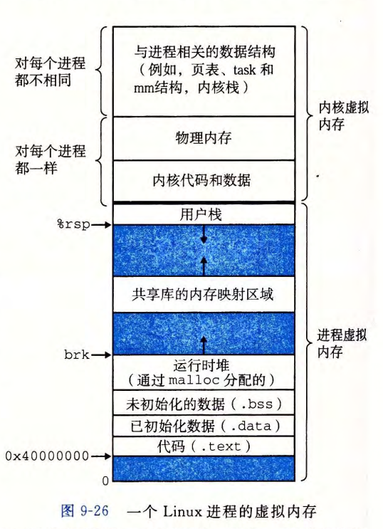


## 9.8 内存映射

**内存映射**（memory mapping）：Linux 通过将一个虚拟内存区域与一个磁盘上的对象 (object) 关联起来，以初始化这个虚拟内存区域的内容，这个过程称为内存映射。其中，磁盘对象有以下两种类型：

- Linux 文件系统中的普通文件
- 匿名文件

利用内存映射可以方便地实现进程间共享对象，示意图如下：

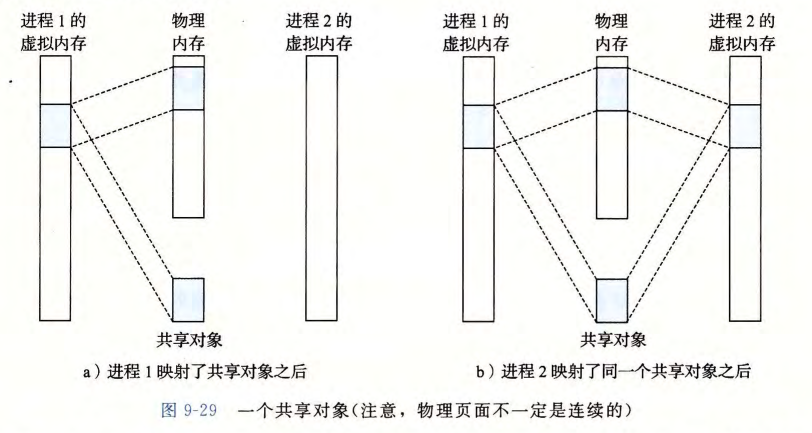

在 Linux 中，进程可以使用 `mmap` 函数来创建新的虚拟内存区域，并将对象映射到这些区域中。使用 `munmap` 函数删除虚拟内存区域。


## 9.9 动态内存分配

动态内存分配器可分为两种：

- 显式分配器：需程序员自行控制内存的分配与回收
- 隐式分配器：分配器检测一个已分配块何时不再被程序使用，然后释放这个块。隐式分配器也叫做垃圾收集器，而自动释放未使用的已分配块的过程叫做垃圾收集（garbage collection）

本小节还介绍了显式分配器实现的一些细节，篇幅较长，具体请参考书籍。


## 9.10 垃圾收集

垃圾收集器将内存视为一张有向可达图：

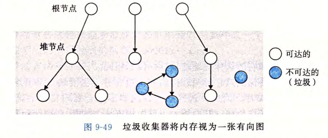

- 根节点：点对应于这样一种不在堆中的位置，它们中包含指向堆中的指针。这些位置可以是寄存器、栈里的变量，或者是虚拟内存中读写数据区域内的全局变量
- 堆节点：表示堆中的一个已分配块

当存在一条从任意根节点出发并到达 p 的有向路径时，我们说节点 p 是可达的 (reachable) 。不可达节点对应于垃圾。


## 9.11 C 程序中常见的与内存有关的错误

1. 间接引用坏指针：引起段错误

   例子：

   ```c
   scanf("%d", &val);	// right
   
   scanf("%d", val);	// wrong!
   ```

   

2. 读未初始化的内存：堆内存并未初始化，调用 `malloc` 函数后不能假设内存值都为 0

3. 允许栈缓冲区溢出

   例子：

   ```c
   void bufoverflow()
   {
       char buf[64];
       gets(buf);	// wrong!  
       return;
   }
   ```

   

4. 假设指针和它们指向的对象是相同大小的

   例子：

   ```c
   int ** makeArray1(int n, int m)
   {
       int i;
       int **A = (int **)Malloc(n * sizeof(int));	// wrong! 应为: sizeof(int*)
       
       for (i = 0; i < n; i++)
       {
           A[i] = (int *)Malloc(m * sizeof(int));
       }
       return A;
   }
   ```

   

5. 造成错位错误

   例子：

   ```c
   int **makeArray2(int n, int m)
   {
       int i;
       int **A = (int **)Malloc(n * sizeof(int *));
       
       for (i = 0; i <= n; i++)	// wrong! 应为: i < n
       {
           A[i] = (int *)Malloc(m * sizeof(int));
       }
       return A;
   }
   ```

   

6. 引用指针，而不是它所指向的对象

   若不注意 C 操作符优先级和结合性，可能错误操作指针，造成错误。例子：

   ```c
   int *binheapDelete(int **binheap, int *size)
   {
       int *packet = binheap[0];
       
       binheap[0] = binheap[*size - 1];
       *size--;	// wrong! 应为: (*size)--
       heapify(binheap, *size, 0);
       return packet;
   }
   ```

   

7. 误解指针运算

   例子：

   ```c
   int *search(int *p, int val)
   {
       while (*p && *p != val)
       {
           p += sizeof(int);	// wrong! 应为: p++  
       }
       return p;
   }
   ```

   

8. 引用不存在的变量

   例子：

   ```c
   int *stackref()
   {
       int val;
       return &val;	// wrong! 典型错误 
   }
   ```

   

9. 引用空闲堆块中的数据

   例子：

   ```c
   int *heapref(int n, int m)
   {
       int i;
       int *x, *y;
       
       x = (int *)Malloc(n * sizeof(int));
       
       // Other calls to malloc and free  
       
       free(x);
       
       y = (int *)Malloc(m * sizeof(int));
       for (i = 0; i < m; ++i)
       {
           y[i] = x[i]++;	// wrong!  
       }
       return y;
   }
   ```

   

10. 引起内存泄漏

    例子：

    ```c
    void leak(int n)
    {
        int *x = (int *)Malloc(n * sizeof(int));  
        
        return;	// wrong! 造成内存泄漏  
    }
    ```

    对于像守护进程和服务器这样的程序来说，内存泄漏是特别严重的，根据定义这些程序是不会终止的。

