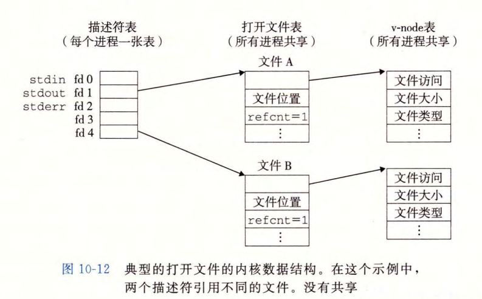

# 第 10 章  系统级 I/O

**输入/输出（I/O）**：在主存和外部设备（例如磁盘驱动器、终端和网络）之间复制数据的过程。

- 输入：从 I/O 设备复制数据到主存
- 输出：从主存复制数据到 I/O 设备


## 10.1 Unix I/O

Linux 文件：一定大小的字节序列

所有 I/O 设备都被模型化为文件，所有的输入输出都被当做对文件的读和写来执行。这使得所有输入输出都能以一种统一且一致的方式执行：

- 打开文件：内核返回文件描述符，是一个非负整数
- Linux Shell 创建的进程开始时打开三个文件：标准输入（描述符为 0）、标准输出（描述符为 1）、标准错误（描述符为 2）
- 改变当前的文件位置：文件位置是从文件开头起始的字节偏移量。应用程序能够通过执行 seek 操作，显式地设置文件的当前位置为 k
- 读写文件：一个读操作就是从文件复制 n>0 个字节到内存，从当前文件位置 k 开始，然后将 k 增加到 k+n 。给定一个大小为 m 字节的文件，当 k ≥ m 时执行读操作会触发一个称为 end-of-file(EOF) 的条件，应用程序能检测到这个条件。在文件结尾处并没有明确的 "EOF 符号” 。类似地，写操作就是从内存复制 n>0 个字节到一个文件，从当前文件位置 k 开始，然后更新 k
- 关闭文件：当应用完成了对文件的访问之后，它就通知内核关闭这个文件。作为响应，内核释放文件打开时创建的数据结构，并将这个描述符恢复到可用的描述符池中。无论一 个进程因为何种原因终止时，内核都会关闭所有打开的文件并释放它们的内存资源。


## 10.2 文件

Linux 中文件类型：

- 普通文件：包含任意数据，可进一步分为文本文件和二进制文件
- 目录：包含一组链接的文件，，其中每个链接都将一个文件名 (filename) 映射到一个文件，这个文件可能是另 一 个目录。每个目录至少含有两个条目：“．”是到该目录自身的链接，以及".. "是到目录层次结构（见下文）中父目录 (parent directory) 的链接
- 套接字：用来与另一个进程进行跨网络通信的文件

其他文件类型包含命名通道 (named pipe) 、符号链接 (symbolic link),  以及字符和块设备 (character and  block  device)。


## 10.3 打开和关闭文件

进程通过调用 `open` 函数来打开一个已存在的文件或者创建一个新文件：

```c
#include <sys/types.h>
#include <sys/stat.h>
#include <fcntl.h>

int open(char *filename, int flags, mode_t mode);	// 返回：若成功则返回新文件描述符；失败返回 -1
```

flags 参数指明了进程如何访问文件：

- O_RDONLY：只读
- O_WRONLY：只写
- O_RDWR：可读可写

flags 参数也可以是 一 个或者更多位掩码的或，为写提供给一些额外的指示：

- O_CREAT：如果文件不存 在 ，就创建它的一个截断的 (truncated) (空）文件 
- O_TRUNC：如果文件巳经存 在，就截断它
- O_APPEND：在每次写操作前，设置文件位置到文件的结尾处

mode 参数指定了新文件的访问权限位：


作为上下文的一部分，每个进程都有一个 umask, 它是通过调用 umask 函数来设置的 。 当进程通过带某个 mode 参数的 open 函数调用来创建一个新文件时，文件的访问权限位被设置为 `mode &  ~ umask `。 

最后，进程通过调用 close 函数关闭一个打开的文件：

```c
#include  <unistd.h> 

int  close(int  fd); 	// 返回：若成功则为 0, 若出错则为 -1
```


## 10.4 读和写文件

应用程序是通过分别调用 read 和 write 函数来执行输入和输出的：

```c
#include  <unistd.h>

ssize_t  read(int  fd,  void  *buf,  size_t  n); 	// 返回：若成功则为读的字节数，若 EOF 则为 0, 若出错为 -1 


ssize_t  write(int  fd,  const  void  *buf,  size_t  n); 	//返回：若成功则为写的字节数，若出错则为 -1    
```

在某些情况下， read 和 write 传送的字节比应用程序要求的要少。这些不足值 (short count) 不表示有错误。出现这样情况的原因有：

-  读时遇到 EOF 
- 从终端读文本行：如果打开文件是与终端相关联的（如键盘和显示器），那么每个 read 函数将一次传送一个文本行，返回的不足值等于文本行的大小
- 读和写网络套接宇 (socket) ：如果打开的文件对应千网络套接字 ，那么内部缓冲约束和较长的网络延迟会引起 read 和 write 返回不足值。对 Linux 管道 (pipe) 调用 read 和 write 时，也有可能出现不足值


## 10.5 用 RIO 包健壮地读写

在像网络程序这样容易出现不足值的应用中， RIO 包提供了方便、健壮和高效的 I/O 。 RIO 提供了两类不同的函数：

- 无缓冲的输入输出函数：这些函数直接在内存和文件之间传送数据，没有应用级缓冲。它们对将二进制数据读写到网络和从网络读写二进制数据尤其有用。
- 带缓冲的输入函数：。这些函数允许你高效地从文件中读取文本行和二进制数据，这些文件的内容缓存在应用级缓冲区内，类似于为 printf 这样的标准 I/O 函数提供的缓冲区。

### 10.5.1 RIO 的无缓冲的输入输出函数

通过调用 rio_readn 和 rio_writen 函数，应用程序可以在内存和文件之间直接传送数据：

```c
#include  "csapp.h" 

ssize_t  rio_readn(int  fd,  void  *usrbuf,  size_t  n); 

ssize_t  rio_writen(int  fd,  void  *usrbuf,  size_t  n); 
// 返回：若成功则为传送的宇节数，若 EOF 则为 0 ( 只对 rio_readn 而言），若出错则为 -1   
```

rio_readn 和 rio_writen 代码实现：

```c
/****************************************
 * The Rio package - Robust I/O functions
 ****************************************/

/*
 * rio_readn - Robustly read n bytes (unbuffered)
 */
/* $begin rio_readn */
ssize_t rio_readn(int fd, void *usrbuf, size_t n)
{
    size_t nleft = n;
    ssize_t nread;
    char *bufp = usrbuf;

    while (nleft > 0) {
        if ((nread = read(fd, bufp, nleft)) < 0) {
            if (errno == EINTR) /* Interrupted by sig handler return */
                nread = 0;      /* and call read() again */
            else
                return -1;      /* errno set by read() */
        }
        else if (nread == 0)
            break;              /* EOF */
        nleft -= nread;
        bufp += nread;
    }
    return (n - nleft);         /* Return >= 0 */
}
/* $end rio_readn */

/*
 * rio_writen - Robustly write n bytes (unbuffered)
 */
/* $begin rio_writen */
ssize_t rio_writen(int fd, void *usrbuf, size_t n)
{
    size_t nleft = n;
    ssize_t nwritten;
    char *bufp = usrbuf;

    while (nleft > 0) {
        if ((nwritten = write(fd, bufp, nleft)) <= 0) {
            if (errno == EINTR)  /* Interrupted by sig handler return */
                nwritten = 0;    /* and call write() again */
            else
                return -1;       /* errno set by write() */
        }
        nleft -= nwritten;
        bufp += nwritten;
    }
    return n;
}
/* $end rio_writen */
```


### 10.5.2 RIO 的带缓冲的输入函数

```c
#include  "csapp.h" 

void  rio_readinitb(rio_t  *rp,  int  fd); 
// 返回：无


ssize_t  rio_readlineb(rio_t  *rp,  void  *usrbuf,  size_t  maxlen); 
ssize_t  rio_readnb(rio_t  *rp,  void  *usrbuf,  size_t  n); 
// 返回：若成功则为读的字节数，若 EOF 则为 0, 若出错则为 -1
```


## 10.6 读取文件元数据

调用 `stat` 和 `fstat` 函数获取文件元数据：

```c
#include <unistd.h>
#include <sys/stat.h>

int stat(const chat *filename, struct stat *buf);
int fstat(int fd, struct stat *buf);	// 成功返回 0；出错返回 -1  
```

`stat` 结构体定义如下：

```c
struct stat
{
    mode_t st_mode; //文件对应的模式，文件，目录等

    ino_t st_ino; // inode节点号

    dev_t st_dev; //设备号码

    dev_t st_rdev; //特殊设备号码

    nlink_t st_nlink; //文件的连接数

    uid_t st_uid; //文件所有者

    gid_t st_gid; //文件所有者对应的组

    off_t st_size; //普通文件，对应的文件字节数

    time_t st_atime; //文件最后被访问的时间

    time_t st_mtime; //文件内容最后被修改的时间

    time_t st_ctime; //文件状态改变时间

    blksize_t st_blksize; //文件内容对应的块大小

    blkcnt_t st_blocks; //伟建内容对应的块数量
};
```


## 10.7 读取目录内容

通过 `readdir` 函数读取目录，示例如下：

```c
/* $begin readdir */
#include "csapp.h"

int main(int argc, char **argv)
{
    DIR *streamp;
    struct dirent *dep;

    /* $end readdir */
    if (argc != 2) {
        printf("usage: %s <pathname>\n", argv[0]);
        exit(1);
    }
    /* $begin readdir */
    streamp = Opendir(argv[1]);	// 打开目录 

    errno = 0;
    while ((dep = readdir(streamp)) != NULL) {	// 调用 readdir 函数读取目录项
        printf("Found file: %s\n", dep->d_name);
    }
    if (errno != 0)
        unix_error("readdir error");

    Closedir(streamp);	// 关闭
    exit(0);
}
/* $end readdir */
```


## 10.8 共享文件

内核表示打开文件的数据结构：

- 描述符表：每个进程有独立的描述符表
- 文件表：所有进程共享。文件表的表项组成包括：当前文件的位置、引用计数、一个指向 v-node 表中对应表项的指针
- v-node 表：所有进程共享。每个表项包含 stat 结构中大多数信息

示意图如下：



文件共享示意图如下：


父/子进程进行文件共享示意图如下：


## 10.9 I/O 重定向

使用 `dup2` 函数实现 I/O 重定向：

```c
#include <unistd.h>

int dup2(int oldfd, int newfd);	// 成功返回非负的描述符；出错返回 -1  
```

dup2 函数复制描述符表表项 oldfd 到描述符表表项 newfd, 覆盖描述符表表项 new­fd 以前的内容。如果 newfd 已经打开了， dup2 会在复制 oldfd 之前关闭 newfd 。

假设调用 `dup2(4, 1)` 之前状态如图 10-12 所示，则调用之后状态如下图所示：


调用之后，两个描述符都指向文件 B，文件 A 已经关闭了，且其文件表和 v-node 表项都被删除了；文件 B 的引用计数增加。此后，任何写到标准输出的数据都被重定向到文件 B 。


## 10.10 标准 I/O

C 语言定义了一组高级输入输出函数，称为标准 I/O 库，为程序员提供了 Unix I/O 的较高级别的替代。


## 10.11 综合：我该使用哪些 I/O 函数？

本章讨论的 I/O 函数如下图所示：


如何选择这些函数的指导原则：

- 只要有可能就使用标准 I/O 。 对磁盘和终端设备 I/O 来说，标准 I/O 函数是首选方法。
- 不要使用 scanf 或 rio_readlineb 来读二进制文件。像 scanf 或 rio_read­lineb 这样的函数是专门设计来读取文本文件的。 
- 对网络套接字的 I/O 使用 RIO 函数 。

