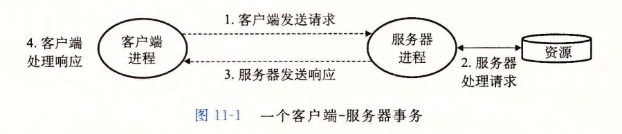
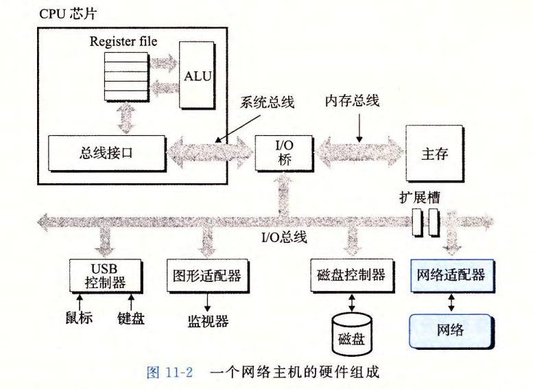
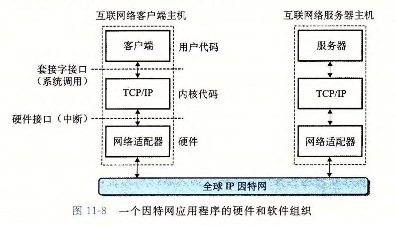
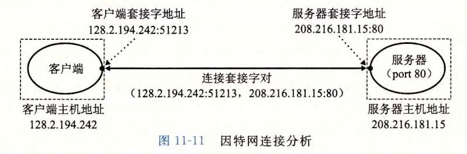
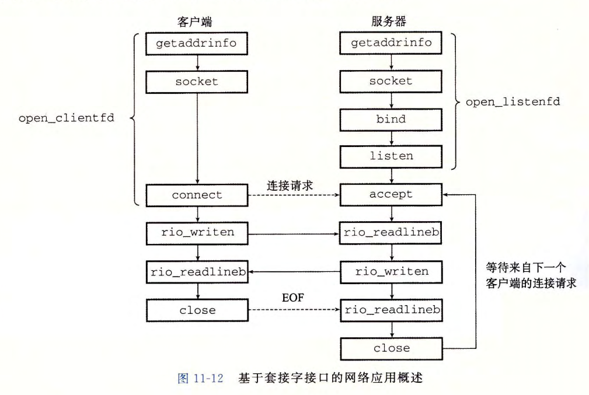
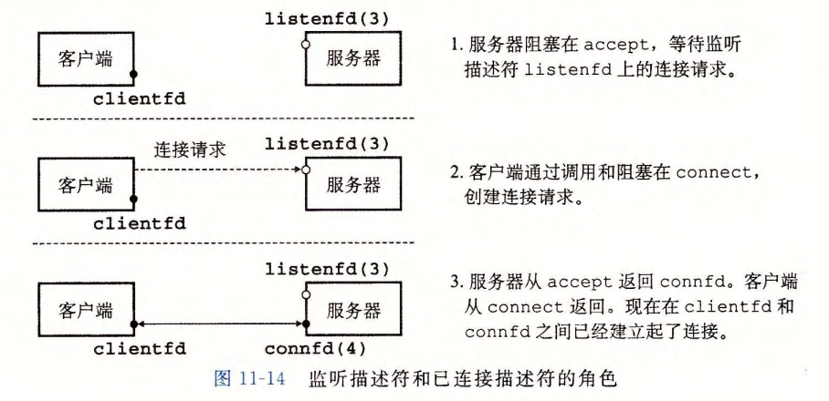

# 第 11 章  网络编程

## 11.1 客户端-服务器编程模型

网络应用全部基于客户端-服务器模型：



注意：客户端和服务器是进程，而不是常提到的机器或者主机。


## 11.2 网络

一个网络主机的硬件组成：




## 11.3 全球 IP 因特网

一个因特网客户端－服务器应用程序的基本硬件和软件组织：



一个 IP 地址就是一个 32 位无符号整数，结构体定义如下：

```c
 /* IP address structure */
struct in_addr {
	uint32_t  s_addr; /* Address in network byte order (big-endian) */   
};
```

为了便于记忆 IP 地址，定义了域名。使用 Linux 中 `nslookup` 命令能够查看 DNS 映射：

```shell
$ nslookup localhost
```


每个套接字拥有一个地址，由 IP 地址 + 端口两部分组成，其中端口为 16 位的整数端口。

客户端套接字地址是内核自动分配的，称为临时端口；服务器套接字地址中的端口通常是某个知名端口，是和这个服务相对应的。每个知名端口的服务都有一个对应的知名的服务名。在 Linux 中，使用命令 `cat /etc/services` 查看机器提供的知名名字和知名端口之间的映射。

一个网络连接是由它两端的套接字地址唯一确定的，叫做套接字对。示意图如下：




## 11.4 套接字接口

套接宇接口 (socket interface) 是一组函数，它们和 Unix I/O 函数结合起来，用以创建网络应用。典型的客户端－ 服务器事务的上下文 中 的套接字接口概述：



### 11.4.1 套接字地址结构

因特网套接字地址存放在下面代码所示的类型为 `sockaddr_in` 的 16 字节结构体中：

```c
/* IP socket address structure */
struct sockaddr_in
{
    uint16_t sin_family;       /* Protocol family (always AF_INET) */
    uint16_t sin_port;         /* Port number in network byte order */
    struct in_addr sin_addr;   /* IP address in network byte order */
    unsigned char sin_zero[8]; /* Pad to sizeof(struct sockaddr) */
};

/* Generic socket address structure (for connect, bind, and accept) */
struct sockaddr
{
    uint16_t sa_family; /* Protocol family */
    char sa_data[14];   /* Address data  */
};
```


### 11.4.2 socket 函数

客户端和服务器使用 `socket` 函数来创建一个套接字描述符：

```c
#include <sys/types.h>
#include <sys/socket.h>

int socket(int domain, int type, int protocol);		// 成功返回非负描述符；出错返回 -1  
```

使用示例：

```c
clientfd =  Socket(AF_INET,  SOCK_STREAM,  O); 
// 其中， AF_INET 表明我们正在使用 32 位 IP 地址，而 SOCK_STREAM 表示这个套接字是连接的一个端点
```


`socket` 函数返回的描述符 clientfd 仅是部分打开的，还不能用于读写。如何完成打开套接字的工作，取决于我们是客户端还是服务器。


### 11.4.3 connect 函数

客户端通过调用 `connect` 函数来建立和服务器的连接：

```c
#include <sys/socket.h>

int connect(int clientfd, const struct sockaddr *addr, socklen_t addrlen);		
// 成功返回 0；出错返回 -1 
```

`connect` 函数试图与套接字地址为 addr 的服务器建立一个因特网连接，其中 addrlen 是 sizeof(sockaddr_in) 。 `connect` 函数会阻塞，一直到连接成功建立或是发生错误。如果成功， clientfd 描述符现在就准备好可以读写了。


### 11.4.4 bind 函数

剩下的套接字函数 `bind`、`listen`、`accept` ，服务器使用它们来与客户端建立连接。

```c
#include <sys/socket.h>

int bind(int sockfd, const struct sockaddr *addr, socklen_t addrlen);		
// 成功返回 0；出错返回 -1  
```

bind 函数告诉内核将 addr 中的服务器套接字地址和套接字描述符 sockfd 联系起来。参数 addrlen 就是 sizeof(sockaddr_in) 。


### 11.4.5 listen 函数

服务器调用 `listen` 函数告诉内核，描述符是被服务器而不是客户端使用的。

```c
#include <sys/socket.h>

int listen(int sockfd, int backlog);	// 成功返回 0；出错返回 -1  
```

`listen` 函数将 sockfd 从一个主动套接字转化为一个 *监听套接字* (listening socket) , 该套接字可以接受来自客户端的连接请求。backlog 参数暗示了内核在开始拒绝连接请求之前，队列中要排队的未完成的连接请求的数最。 backlog 参数的确切含义要求对 TCP/IP 协议的理解，这超出了我们讨论的范围。通常我们会把它设置为一个较大的值，比如 1024 。


### 11.4.6 accept 函数

服务器通过调用 `accept` 函数来等待来自客户端的连接请求：

```c
#include <sys/socket.h>

int accept(int listenfd, struct sockaddr *addr, int *addrlen);    
// 成功返回非负连接描述符；出错返回 -1  
```

`accept` 函数等待来自客户端的连接请求到达侦听描述符 listenfd, 然后在 addr 中填写客户端的套接字地址，并返回一个已连接描述符 (connected descriptor) ,  这个描述符可被用来利用 Unix I/O 函数与客户端通信。

注意 **监听描述符** 和 **已连接描述符** 之间的区别：

- 监听描述符：监听描述符是作为客户端连接请求的一个端点。它通常被创建一次，并存在于服务器的整个生命周期。
- 已连接描述符：已连接描述符是客户端和服务器之间已经建立起来了的连接的一个端点。服务器每次接受连接请求时都会创建一次，它只存在于服务器为一个客户端服务的过程中。

示意图如下：




### 11.4.7 主机和服务的转换

1. `getaddrinfo` 函数

   `getaddrinfo` 函数将数将主机名、主机地址、服务名和端口号的字符串表示转化成套接字地址结构。这个函数是可重入的，适用于任何协议。

   ```c
   #include <sys/types.h> 
   #include <sys/socket.h> 
   #include <netdb.h> 
   
   int  getaddrinfo(const  char  *host,  const  char  *service,  const  struct  addrinfo  *hints, struct  addrinfo  **result); 
   // 返回：如果成功则为 0, 如果错误则为非零的错误代码
   
   void  freeaddrinfo(struct  addrinfo  *result); 
   // 返回：无
   
   const  char  *gai_strerror(int  errcode); 
   // 返回：错误消息
   ```

   其中，结构体 `addrinfo` 定义如下：

   ```c
   struct addrinfo
   {
       int ai_flags;             /* Hints argument flags */
       int ai_family;            /* First arg to socket function */
       int ai_socktype;          /* Second arg to socket function */
       int ai_protocol;          /* Third arg to socket function  */
       char *ai_canonname;       /* Canonical hostname */
       size_t ai_addrlen;        /* Size of ai_addr struct */
       struct sockaddr *ai_addr; /* Ptr to socket address structure */
       struct addrinfo *ai_next; /* Ptr to next item in linked list */
   };
   ```

   

2. `getnameinfo` 函数

   `getnameinfo` 函数和 `getaddrinfo` 是相反的，将一个套接字地址结构转换成相应的主机和服务名字符串。它是可重入和与协议无关的。

   ```c
   #include <sys/socket.h>
   #include <netdb.h>
   
   int getnameinfo(const struct sockaddr *sa, socklen_t salen,
                   char *host, size_t hostlen,
                   char *service, size_t servlen, int flags);
   // 返回：如果成功则为 0, 如果错误则为非零的错误代码
   ```

使用上述函数，实现简单的 `nslookup` 功能，代码如下：

```c
/* $begin hostinfo */
#include "csapp.h"

int main(int argc, char **argv)
{
    struct addrinfo *p, *listp, hints;
    char buf[MAXLINE];
    int rc, flags;

    if (argc != 2) {
        fprintf(stderr, "usage: %s <domain name>\n", argv[0]);
        exit(0);
    }

    /* Get a list of addrinfo records */
    memset(&hints, 0, sizeof(struct addrinfo));
    hints.ai_family = AF_INET;       /* IPv4 only */        //line:netp:hostinfo:family
    hints.ai_socktype = SOCK_STREAM; /* Connections only */ //line:netp:hostinfo:socktype
    if ((rc = getaddrinfo(argv[1], NULL, &hints, &listp)) != 0) {
        fprintf(stderr, "getaddrinfo error: %s\n", gai_strerror(rc));
        exit(1);
    }

    /* Walk the list and display each IP address */
    flags = NI_NUMERICHOST; /* Display address string instead of domain name */
    for (p = listp; p; p = p->ai_next) {
        Getnameinfo(p->ai_addr, p->ai_addrlen, buf, MAXLINE, NULL, 0, flags);
        printf("%s\n", buf);
    }

    /* Clean up */
    Freeaddrinfo(listp);

    exit(0);
}
/* $end hostinfo */
```


### 11.4.8 套接字接口辅助函数

使用下面封装后的函数可以方便地进行网络编程：

1. `open_clientfd` 函数

   客户端调用 `open_clientfd` 建立与服务器的连接：

   ```c
   #include "csapp.h"
   
   int open_clientfd(char *hostname, char *port);
   // 返回：若成功则为描述符，若出错则为 -1
   ```

   `open_clientfd` 函数源码如下：

   ```c
   /********************************
    * Client/server helper functions
    ********************************/
   /*
    * open_clientfd - Open connection to server at <hostname, port> and
    *     return a socket descriptor ready for reading and writing. This
    *     function is reentrant and protocol-independent.
    *
    *     On error, returns:
    *       -2 for getaddrinfo error
    *       -1 with errno set for other errors.
    */
   /* $begin open_clientfd */
   int open_clientfd(char *hostname, char *port) {
       int clientfd, rc;
       struct addrinfo hints, *listp, *p;
   
       /* Get a list of potential server addresses */
       memset(&hints, 0, sizeof(struct addrinfo));
       hints.ai_socktype = SOCK_STREAM;  /* Open a connection */
       hints.ai_flags = AI_NUMERICSERV;  /* ... using a numeric port arg. */
       hints.ai_flags |= AI_ADDRCONFIG;  /* Recommended for connections */
       if ((rc = getaddrinfo(hostname, port, &hints, &listp)) != 0) {
           fprintf(stderr, "getaddrinfo failed (%s:%s): %s\n", hostname, port, gai_strerror(rc));
           return -2;
       }
   
       /* Walk the list for one that we can successfully connect to */
       for (p = listp; p; p = p->ai_next) {
           /* Create a socket descriptor */
           if ((clientfd = socket(p->ai_family, p->ai_socktype, p->ai_protocol)) < 0)
               continue; /* Socket failed, try the next */
   
           /* Connect to the server */
           if (connect(clientfd, p->ai_addr, p->ai_addrlen) != -1)
               break; /* Success */
           if (close(clientfd) < 0) { /* Connect failed, try another */  //line:netp:openclientfd:closefd
               fprintf(stderr, "open_clientfd: close failed: %s\n", strerror(errno));
               return -1;
           }
       }
   
       /* Clean up */
       freeaddrinfo(listp);
       if (!p) /* All connects failed */
           return -1;
       else    /* The last connect succeeded */
           return clientfd;
   }
   /* $end open_clientfd */
   ```

   

2. `open_listenfd` 函数

   调用 `open_listenfd` 函数，服务器创建一个监听描述符，准备好接收连接请求：

   ```c
   #include "csapp.h"
   
   int open_listenfd(char *port);		// 返回：成功返回描述符；出错返回 -1    
   ```

   `open_listenfd` 函数源码如下：

   ```c
   /*
    * open_listenfd - Open and return a listening socket on port. This
    *     function is reentrant and protocol-independent.
    *
    *     On error, returns:
    *       -2 for getaddrinfo error
    *       -1 with errno set for other errors.
    */
   /* $begin open_listenfd */
   int open_listenfd(char *port)
   {
       struct addrinfo hints, *listp, *p;
       int listenfd, rc, optval=1;
   
       /* Get a list of potential server addresses */
       memset(&hints, 0, sizeof(struct addrinfo));
       hints.ai_socktype = SOCK_STREAM;             /* Accept connections */
       hints.ai_flags = AI_PASSIVE | AI_ADDRCONFIG; /* ... on any IP address */
       hints.ai_flags |= AI_NUMERICSERV;            /* ... using port number */
       if ((rc = getaddrinfo(NULL, port, &hints, &listp)) != 0) {
           fprintf(stderr, "getaddrinfo failed (port %s): %s\n", port, gai_strerror(rc));
           return -2;
       }
   
       /* Walk the list for one that we can bind to */
       for (p = listp; p; p = p->ai_next) {
           /* Create a socket descriptor */
           if ((listenfd = socket(p->ai_family, p->ai_socktype, p->ai_protocol)) < 0)
               continue;  /* Socket failed, try the next */
   
           /* Eliminates "Address already in use" error from bind */
           setsockopt(listenfd, SOL_SOCKET, SO_REUSEADDR,    //line:netp:csapp:setsockopt
                      (const void *)&optval , sizeof(int));
   
           /* Bind the descriptor to the address */
           if (bind(listenfd, p->ai_addr, p->ai_addrlen) == 0)
               break; /* Success */
           if (close(listenfd) < 0) { /* Bind failed, try the next */
               fprintf(stderr, "open_listenfd close failed: %s\n", strerror(errno));
               return -1;
           }
       }
   
   
       /* Clean up */
       freeaddrinfo(listp);
       if (!p) /* No address worked */
           return -1;
   
       /* Make it a listening socket ready to accept connection requests */
       if (listen(listenfd, LISTENQ) < 0) {
           close(listenfd);
           return -1;
       }
       return listenfd;
   }
   /* $end open_listenfd */
   ```

   

### 11.4.9 echo 客户端和服务器的示例

`echoclient.c` 源码如下：

```c
/*
 * echoclient.c - An echo client
 */
/* $begin echoclientmain */
#include "csapp.h"

int main(int argc, char **argv)
{
    int clientfd;
    char *host, *port, buf[MAXLINE];
    rio_t rio;

    if (argc != 3) {
        fprintf(stderr, "usage: %s <host> <port>\n", argv[0]);
        exit(0);
    }
    host = argv[1];
    port = argv[2];

    clientfd = Open_clientfd(host, port);
    Rio_readinitb(&rio, clientfd);

    while (Fgets(buf, MAXLINE, stdin) != NULL) {
        Rio_writen(clientfd, buf, strlen(buf));
        Rio_readlineb(&rio, buf, MAXLINE);
        Fputs(buf, stdout);
    }
    Close(clientfd); //line:netp:echoclient:close
    exit(0);
}
/* $end echoclientmain */
```

`echoserveri.c` 源码如下：

```c
/*
 * echoserveri.c - An iterative echo server
 */
/* $begin echoserverimain */
#include "csapp.h"

void echo(int connfd);

int main(int argc, char **argv)
{
    int listenfd, connfd;
    socklen_t clientlen;
    struct sockaddr_storage clientaddr;  /* Enough space for any address */  //line:netp:echoserveri:sockaddrstorage
    char client_hostname[MAXLINE], client_port[MAXLINE];

    if (argc != 2) {
        fprintf(stderr, "usage: %s <port>\n", argv[0]);
        exit(0);
    }

    listenfd = Open_listenfd(argv[1]);
    while (1) {
        clientlen = sizeof(struct sockaddr_storage);
        connfd = Accept(listenfd, (SA *)&clientaddr, &clientlen);
        Getnameinfo((SA *) &clientaddr, clientlen, client_hostname, MAXLINE,
                    client_port, MAXLINE, 0);
        printf("Connected to (%s, %s)\n", client_hostname, client_port);
        echo(connfd);
        Close(connfd);
    }
    exit(0);
}
/* $end echoserverimain */
```

`echo` 函数源码如下：

```c
/*
 * echo - read and echo text lines until client closes connection
 */
/* $begin echo */
#include "csapp.h"

void echo(int connfd)
{
    size_t n;
    char buf[MAXLINE];
    rio_t rio;

    Rio_readinitb(&rio, connfd);
    while((n = Rio_readlineb(&rio, buf, MAXLINE)) != 0) { //line:netp:echo:eof
        printf("server received %d bytes\n", (int)n);
        Rio_writen(connfd, buf, n);
    }
}
/* $end echo */
```


## 11.5 Web 服务器

介绍了 Web 服务器相关的基础知识和 HTTP 协议一些内容，略。


## 11.6 综合：Tiny Web 服务器

本小节实现了一个 Web 服务器，具体内容略。

