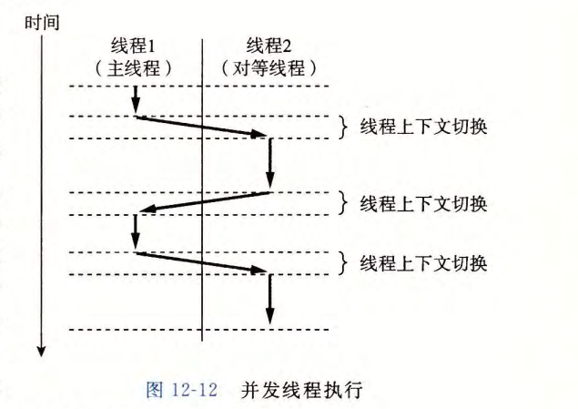
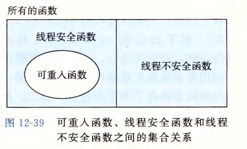
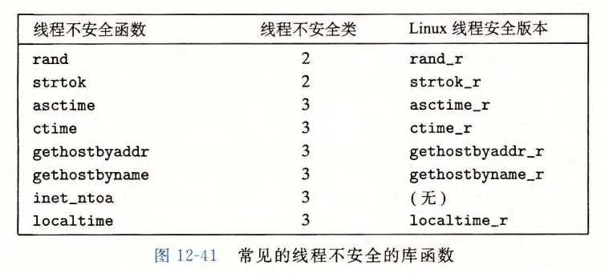

# 第 12 章  并发编程

使用应用级并发的应用程序称为并发程序 (concurrent program) 。现代操作系统提供了三种基本的构造并发程序的方法：

- 进程
- I/O 多路复用
- 线程

## 12.1 基于进程的并发编程

在父进程中接受客户端连接请求，然后创建一个新的子进程来为每个新客户端提供服务。


代码示例：

```c
#include "csapp.h"
void echo(int connfd);

void sigchld_handler(int sig) //line:conc:echoserverp:handlerstart
{
    while (waitpid(-1, 0, WNOHANG) > 0)
        ;
    return;
} //line:conc:echoserverp:handlerend

int main(int argc, char **argv)
{
    int listenfd, connfd;
    socklen_t clientlen;
    struct sockaddr_storage clientaddr;

    if (argc != 2) {
        fprintf(stderr, "usage: %s <port>\n", argv[0]);
        exit(0);
    }

    Signal(SIGCHLD, sigchld_handler);
    listenfd = Open_listenfd(argv[1]);
    while (1) {
        clientlen = sizeof(struct sockaddr_storage);
        connfd = Accept(listenfd, (SA *) &clientaddr, &clientlen);
        if (Fork() == 0) {
            Close(listenfd); /* Child closes its listening socket */
            echo(connfd);    /* Child services client */ //line:conc:echoserverp:echofun
            Close(connfd);   /* Child closes connection with client */ //line:conc:echoserverp:childclose
            exit(0);         /* Child exits */
        }
        Close(connfd); /* Parent closes connected socket (important!) */ //line:conc:echoserverp:parentclose
    }
}
```


注意点：

- 首先，通常服务器会运行很长的时间，所以我们必须要包括一个 SIGCHLD 处理程序，来回收僵死 (zombie) 子进程的资源（第 4~9 行）。因为当 SIGCHLD 处理程序执行时， SIGCHLD 信号是阻塞的，而 Linux 信号是不排队的，所以 SIGCHLD 处理程序必须准备好回收多个僵死子进程的资源。
- 其次，父子进程必须关闭它们各自的 connfd( 分别为第 33 行和第 30 行）副本。就像我们已经提到过的，这对父进程而言尤为重要，它必须关闭它的已连接描述符，以避免内存泄漏。
- 最后，因为套接字的文件表表项中的引用计数，直到父子进程的 connfd 都关闭了，到客户端的连接才会终止。


优缺点：

- 优点：一个进程不可能不小心覆盖另一个进程的虚拟内存，这就消除了许多令人迷惑的错误
- 缺点：独立的地址空间使得进程共享状态 信 息变得更加困难。为了共享信息，它们必须使用显式的 IPC( 进程间通信 ） 机制 。基于进程的设计的另一个缺点是，它们往往比较慢，因为进程控制和 IPC 的开销很高。


## 12.2 基于I/O 多路复用的并发编程

使用 `select` 函数，要求内核挂起进程，只有在一个或多个 I/O 事件发生后，才将控制返回给应用程序。

```c
#include <sys/select.h>

int  select(int  n,  fd_set  *fdset,  NULL,  NULL,  NULL); // 返回已准备好的描述符的非零的个数，出错返回 -1   

FD_ZERO(fd_set *fdset); 			// Clear  all bits  in  fdset  
FD_CLR(int  fd,  fd_set *fdset); 	// Clear  bit  fd  in  fdset  
FD_SET(int  fd,  fd_set *fdset); 	// Turn  on  bit  fd  in  fdset  
FD_ISSET(int  fd,  fd_set *fdset);	// Is  bit  fd  in  fdset  on?   
```


代码示例：

```c
#include "csapp.h"
void echo(int connfd);
void command(void);

int main(int argc, char **argv)
{
    int listenfd, connfd;
    socklen_t clientlen;
    struct sockaddr_storage clientaddr;
    fd_set read_set, ready_set;

    if (argc != 2) {
        fprintf(stderr, "usage: %s <port>\n", argv[0]);
        exit(0);
    }
    listenfd = Open_listenfd(argv[1]);  //line:conc:select:openlistenfd

    FD_ZERO(&read_set);              /* Clear read set */ //line:conc:select:clearreadset
    FD_SET(STDIN_FILENO, &read_set); /* Add stdin to read set */ //line:conc:select:addstdin
    FD_SET(listenfd, &read_set);     /* Add listenfd to read set */ //line:conc:select:addlistenfd

    while (1) {
        ready_set = read_set;
        Select(listenfd+1, &ready_set, NULL, NULL, NULL); //line:conc:select:select
        if (FD_ISSET(STDIN_FILENO, &ready_set)) //line:conc:select:stdinready
            command(); /* Read command line from stdin */
        if (FD_ISSET(listenfd, &ready_set)) { //line:conc:select:listenfdready
            clientlen = sizeof(struct sockaddr_storage);
            connfd = Accept(listenfd, (SA *)&clientaddr, &clientlen);
            echo(connfd); /* Echo client input until EOF */
            Close(connfd);
        }
    }
}

void command(void) {
    char buf[MAXLINE];
    if (!Fgets(buf, MAXLINE, stdin))
        exit(0); /* EOF */
    printf("%s", buf); /* Process the input command */
}
```


优缺点：

- 优点：比基于进程的设计给了程序员更多的对程序行为的控制；在流之间共享数据容易；高效
- 缺点：编码复杂


## 12.3 基于线程的并发编程

线程 (thread) 就是运行在进程上下文中的逻辑流。每个线程都有它自己的线程上下文 (thread context),  包括一个唯一的整数线程 ID (Thread ID,  TID) 、栈、栈指针、程序计数器、通用目的寄存器和条件码。所有的运行在一个进程里的线程共享该进程的整个虚拟地址空间。

### 12.3.1 线程执行模型

与进程并发执行类似，不过线程上下文切换比进程快得多。



### 12.3.2 Posix 线程

Posix 线程 (Pthreads) 是在 C 程序中处理线程的一个标准接口。

例子：

```c
#include "csapp.h"
void *thread(void *vargp);                    //line:conc:hello:prototype

int main()                                    //line:conc:hello:main
{
    pthread_t tid;                            //line:conc:hello:tid
    Pthread_create(&tid, NULL, thread, NULL); //line:conc:hello:create
    Pthread_join(tid, NULL);                  //line:conc:hello:join
    exit(0);                                  //line:conc:hello:exit
}

void *thread(void *vargp) /* thread routine */  //line:conc:hello:beginthread
{
    printf("Hello, world!\n");
    return NULL;                               //line:conc:hello:return
}                                              //line:conc:hello:endthread
```


### 12.3.3 创建线程

线程通过调用 `pthread_create` 函数来创建其他线程。

```c
#include <pthread.h>

typedef void *(func)(void *);

int pthread_create(pthread_t *tid, pthread_attr_t *attr, func *f, void *arg);  
// 成功返回 0；出错返回非零  
```

`pthread_create` 函数创建一个新的线程，并带着一个输入变量 `arg`, 在新线程的上下文中运行 `线程例程 f` 。能用 `attr` 参数来改变新创建线程的默认属性。改变这些属性已超出我们学习的范围，在我们的示例中，总是用一个为 NULL 的 `attr` 参数来调用 `pthread_create` 函数。

当 `pthread_create` 返回时，参数 `tid` 包含新创建线程的 ID 。新线程可以通过调用 `pthread_self` 函数来获得它自己的线程 ID 。

```c
#include  <pthread.h> 

pthread_t  pthread_self(void); 	// 返回调用者的线程 ID   
```


### 12.3.4 终止线程

线程终止方式：

- 当顶层的线程例程返回时，线程会隐式地终止
- 通过调用 `pthread_exit` 函数，线程会显式地终止 。 如果主线程调用 `pthread_ exit`，它会等待所有其他对等线程终止，然后再终止主线程和整个进程，返回值为 `thread _return` 

```c
#include <pthread.h>

int pthread_exit(void *thread_return);	// 从不返回  
```

- 某个对等线程调用 Linux 的 `exit` 函数，该函数终止进程以及所有与该进程相关的线程 
- 另一个对等线程通过以当前线程 ID 作为参数调用 `pthread_cancel` 函数来终止当前线程 

```c
#include <pthread.h>

int pthread_cancel(pthread_t tid);	// 成功返回 0；出错返回非零  
```


### 12.3.5 回收已终止线程的资源

线程通过调用 `pthread_join` 函数等待其他线程终止。

```c
#include <pthread.h>

int  pthread_join(pthread_t tid,  void **thread_return); 	// 成功返回 0；出错返回非零  
```

`pthread_join` 函数会阻塞，直到线程 `tid` 终止，将线程例程返回的通用 (void*) 指针赋值为 t`hread_return` 指向的位置，然后回收己终止线程占用的所有内存资源。


### 12.3.6 分离线程

在任何一个时间点上，线程是可结合的 (joinable) 或者是分离的 (detached) 。一个可结合的线程能够被其他线程收回和杀死 。 在被其他线程回收之前，它的内存资源（例如栈）是不释放的。相反，一个分离的线程是不能被其他线程回收或杀死的。它的内存资源在它终止时由系统自动释放。

默认情况下，线程被创建成可结合的。为了避免内存泄漏，每个可结合线程都应该要么被其他线程显式地收回，要么通过调用 `pthread_detach` 函数被分离。

```c
#include <pthread.h>

int  pthread_detach(pthread_t  tid); 	// 成功返回 0；出错返回非零    
```

`pthread_detach` 函数分离可结合线程 `tid` 。线程能够通过以 `pthread_self()` 为参数的 `pthread_detach` 调用来分离它们自己。


### 12.3.7 初始化线程

`pthread_once` 函数用于初始化与线程例程相关的状态：

```c
#include <pthread.h>

pthread_once_t once_control =  PTHREAD_ONCE_INIT;

int  pthread_once(pthread_once_t *once_control, void (*init_routine)(void)); 	// 总是返回 0    
```

`once_control` 变量是一个全局或者静态变量，总是被初始化为 `PTHREAD_ONCE_INIT` 。当你第一次用参数 `once_control` 调用 `pthread_once` 时，它调用 `init routine`, 这是一个没有输入参数、也不返回什么的函数。接下来的以 `once_control` 为参数的 `pthread_once` 调用不做任何事情。无论何时，当你需要动态初始化多个线程共享的全局变最时， `pthread_once` 函数是很有用的。


### 12.3.8 基于线程的并发服务器

代码示例：

```c
#include "csapp.h"

void echo(int connfd);
void *thread(void *vargp);

int main(int argc, char **argv)
{
    int listenfd, *connfdp;
    socklen_t clientlen;
    struct sockaddr_storage clientaddr;
    pthread_t tid;

    if (argc != 2) {
        fprintf(stderr, "usage: %s <port>\n", argv[0]);
        exit(0);
    }
    listenfd = Open_listenfd(argv[1]);

    while (1) {
        clientlen=sizeof(struct sockaddr_storage);
        connfdp = Malloc(sizeof(int)); //line:conc:echoservert:beginmalloc
        *connfdp = Accept(listenfd, (SA *) &clientaddr, &clientlen); //line:conc:echoservert:endmalloc
        Pthread_create(&tid, NULL, thread, connfdp);
    }
}

/* Thread routine */
void *thread(void *vargp)
{
    int connfd = *((int *)vargp);
    Pthread_detach(pthread_self()); //line:conc:echoservert:detach
    Free(vargp);                    //line:conc:echoservert:free
    echo(connfd);
    Close(connfd);
    return NULL;
}
```


## 12.4 多线程程序中的共享变量

介绍线程内存模型和变量映射到内存方式，与进程基本相同，具体内容略。


## 12.5 用信号量同步线程

Posix 标准定义了许多操作信号量的函数。

```c
#include <semaphore.h>

int sem_init(sem_t *sem, O, unsigned int value); 	// 将信号量 sem 初始化为 value    
int sem_wait(sem_t *s);  /*  P(s)  */  
int sem_post(sem_t *s);  /*  V(s)  */  				// 成功返回 0；出错返回 -1    
```


信号量提供了一种很方便的方法来确保对共享变量 的互斥访问 。基本思想是将每个共享变量（ 或者一组相关的共享变量）与一个信号量 s( 初始为 1) 联系起 来 ， 然 后用 P(s) 和 V(s) 操作将相应的临界区包围起来 。

以这种方式来保护共享变量 的信号量叫做 **二元信号量** ( binary semaphore ),  因为它的值总是 0 或者 1 。 以提供互斥为目的的二元信号量常常也称为 **互斥锁**( mute x ) 。 在一个互斥锁上执行 P 操作称为对互斥锁加锁 。类似地 ， 执 行 V 操作称为对互斥锁解 锁。 对一个互斥锁加了锁但是还没有解锁的线程称为占用这个互斥锁 。一 个被用作一组可用资源的计数器的信号量 被称为 **计数信号量** 。

例子：

```c
/* WARNING: This code is buggy! */
#include "csapp.h"

void *thread(void *vargp);  /* Thread routine prototype */

/* Global shared variable */
volatile long cnt = 0; /* Counter */

int main(int argc, char **argv)
{
    long niters;
    pthread_t tid1, tid2;

    /* Check input argument */
    if (argc != 2) {
        printf("usage: %s <niters>\n", argv[0]);
        exit(0);
    }
    niters = atoi(argv[1]);

    /* Create threads and wait for them to finish */
    Pthread_create(&tid1, NULL, thread, &niters);
    Pthread_create(&tid2, NULL, thread, &niters);
    Pthread_join(tid1, NULL);
    Pthread_join(tid2, NULL);

    /* Check result */
    if (cnt != (2 * niters))
        printf("BOOM! cnt=%ld\n", cnt);
    else
        printf("OK cnt=%ld\n", cnt);
    exit(0);
}

/* Thread routine */
void *thread(void *vargp)
{
    long i, niters = *((long *)vargp);

    for (i = 0; i < niters; i++) //line:conc:badcnt:beginloop
        cnt++;                   //line:conc:badcnt:endloop

    return NULL;
}


/*  --------------------------------------------------------------------  */

// Fix
/* $begin goodcnt */
#include "csapp.h"

void *thread(void *vargp); /* Thread routine prototype */

/* Global shared variables */
/* $begin goodcntsemdef */
    volatile long cnt = 0; /* Counter */
    sem_t mutex;           /* Semaphore that protects counter */
/* $end goodcntsemdef */

int main(int argc, char **argv)
{
    int niters;
    pthread_t tid1, tid2;

    /* Check input argument */
    if (argc != 2) {
        printf("usage: %s <niters>\n", argv[0]);
        exit(0);
    }
    niters = atoi(argv[1]);

    /* Create threads and wait for them to finish */
/* $begin goodcntseminit */
    Sem_init(&mutex, 0, 1);  /* mutex = 1 */
/* $end goodcntseminit */
    Pthread_create(&tid1, NULL, thread, &niters);
    Pthread_create(&tid2, NULL, thread, &niters);
    Pthread_join(tid1, NULL);
    Pthread_join(tid2, NULL);

    /* Check result */
    if (cnt != (2 * niters))
        printf("BOOM! cnt=%ld\n", cnt);
    else
        printf("OK cnt=%ld\n", cnt);
    exit(0);
}

/* Thread routine */
void *thread(void *vargp)
{
    int i, niters = *((int *)vargp);

/* $begin goodcntthread */
    for (i = 0; i < niters; i++) {
        P(&mutex);
        cnt++;
        V(&mutex);	// 加互斥锁
    }
/* $end goodcntthread */
    return NULL;
}
```


除了提供互斥之外，信号量的另一个重要作用是调度对共享资源的访问。典型问题有：生产者-消费者和读者-写者问题。操作系统课程一般对其已有介绍，此处略。


## 12.6 使用线程提高并行性

并行编程的一项重要教训：同步开销巨大，要尽可能避免。如果无可避免，必须要用尽可能多的有用计算弥补这个开销。（可以使用局部变量来减少同步开销）

并行程序通常被写为每个核上只运行一个线程。


## 12.7 其他并发问题

本小节为写并发程序时需要注意的一些问题的（非常不完整的）综述。

1. 线程安全

   当用线程编写程序时，必须小心地编写那些具有称为线程安全性 (thread safety) 属性的函数。一个函数被称为线程安全的 (threadsafe) ,  当且仅当被多个并发线程反复地调用时，它会一直产生正确的结果。

   四个（不相交的）线程不安全函数类：

   - 不保护共享变量的函数：利用 PV 操作解决
   - 保持跨越多个调用的状态的函数：重写函数
   - 返回指向静态变量的指针的函数：重写函数；使用加锁-复制技术，基本思想是将线程不安全函数与互斥锁联系起来。在每一个调用位置，对互斥锁加锁，调用线程不安全函数，将函数返回的结果复制到一个私有的内存位置，然后对互斥锁解锁。为了尽可能地减少对调用者的修改，你应该定义一个线程安全的包装函数，它执行加锁－复制，然后通过调用这个包装函数来取代所有对线程不安全函数的调用
   - 调用线程不安全函数的函数：重写函数；用互斥锁保护调用位置和任何得到的共享数据 

2. 可重入性

   有一类重要的线程安全函数，叫做可重入函数 (reentrant function) ,  其特点在于它们具有这样一种属性：当它们被多个线程调用时，不会引用任何共享数据。

   

   

3. 在线程化的程序中使用已存在的库函数

   大多数 Linux 函数，包括定义在标准 C 库中的函数（例如 malloc 、 free 、 realloc 、printf 和 scanf) 都是线程安全的，只有一小部分是例外：

   

   Linux 系统提供大多数线程不安全函数的可重入版本 。 可重入版本的名字总是以" r" 后缀结尾。例如， asctime 的可重入版本就叫做 asctime_r 。

4. 竞争

   当一个程序的正确性依赖千一个线程要在另一个线程到达 y 点之前到达它的控制流中的 x 点时，就会发生竞争(race) 。

   例子：

   竞争版本：

   ```c
   /* WARNING: This code is buggy! */
   #include "csapp.h"
   #define N 4
   
   void *thread(void *vargp);
   
   int main()
   {
       pthread_t tid[N];
       int i;
   
       for (i = 0; i < N; i++)                        //line:conc:race:incri
           Pthread_create(&tid[i], NULL, thread, &i); //line:conc:race:createthread
       for (i = 0; i < N; i++)
           Pthread_join(tid[i], NULL);
       exit(0);
   }
   
   /* Thread routine */
   void *thread(void *vargp)
   {
       int myid = *((int *)vargp);  //line:conc:race:derefarg
       printf("Hello from thread %d\n", myid);
       return NULL;
   }
   ```

   修复版本：（利用动态内存分配消除竞争）

   ```c
   /* $begin norace */
   #include "csapp.h"
   #define N 4
   
   void *thread(void *vargp);
   
   int main()
   {
       pthread_t tid[N];
       int i, *ptr;
   
       for (i = 0; i < N; i++) {
           ptr = Malloc(sizeof(int));                    //line:conc:norace:createthread1
           *ptr = i;                                     //line:conc:norace:createthread2
           Pthread_create(&tid[i], NULL, thread, ptr);   //line:conc:norace:createthread3
       } //line:conc:norace:endloop
       for (i = 0; i < N; i++)
           Pthread_join(tid[i], NULL);
       exit(0);
   }
   
   /* Thread routine */
   void *thread(void *vargp)
   {
       int myid = *((int *)vargp); //line:conc:norace:assign
       Free(vargp);
       printf("Hello from thread %d\n", myid);
       return NULL;
   }
   /* $end norace */
   ```

   

5. 死锁

   **互斥锁加锁顺序规则**：给定所有互斥操作的一个全序，如果每个线程都是以一种顺序获得互斥锁并以相反的顺序释放，那么这个程序就是无死锁的。

